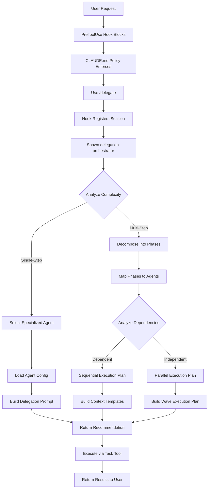

# CLAUDE.md

This file provides guidance to Claude Code when working with the Claude Code Delegation System.

---

## CRITICAL: Delegation Policy

**MANDATORY IMMEDIATE DELEGATION ON TOOL BLOCK**

When ANY tool is blocked by the delegation policy hook:

1. **DO NOT try alternative approaches** (different tools, workarounds, etc.)
2. **DO NOT explain what you tried** - just delegate immediately
3. **IMMEDIATELY use `/delegate <task>`** on first tool block
4. **The entire user request must be delegated**, not just the blocked tool

### Recognition Pattern

```
Error: PreToolUse:* hook error: [...] 🚫 Tool blocked by delegation policy
Tool: <ToolName>

⚠️ STOP: Do NOT try alternative tools.
✅ REQUIRED: Use /delegate command immediately:
   /delegate <full task description>
```

When you see this error pattern, **stop immediately** and delegate the entire task.

### Correct vs Incorrect Examples

**Example - WRONG:**
```
❌ Read blocked → Try Glob → Glob blocked → Try Grep → Grep blocked → Finally delegate
```

**Example - CORRECT:**
```
✅ Read blocked → Immediately use: /delegate <full task description>
```

### The Delegation Flow


### Key Points

- **First tool block = immediate delegation** - Don't try alternatives
- **Delegate the entire user request** - Not just the blocked operation
- **Follow the error message instructions** - They tell you exactly what to do
- **Session registration happens automatically** - First `/delegate` marks session as delegated
- **Specialized agents handle execution** - Orchestrator routes to expert agents

---

## Commands

### Installation

```bash
# Copy configuration to Claude Code directory
cp -r src/agents src/commands src/hooks src/system-prompts src/scripts src/settings.json ~/.claude/

# Make hooks executable
chmod +x ~/.claude/hooks/PreToolUse/require_delegation.sh
chmod +x ~/.claude/hooks/UserPromptSubmit/clear-delegation-sessions.sh
chmod +x ~/.claude/hooks/PostToolUse/python_posttooluse_hook.sh
chmod +x ~/.claude/hooks/stop/python_stop_hook.sh
chmod +x ~/.claude/scripts/statusline.sh

# Verify installation
ls -la ~/.claude/hooks/PreToolUse/require_delegation.sh
```

### Usage

**Single-Step Delegation:**
```bash
/delegate Create a calculator module with add, subtract, multiply, divide functions
```

**Multi-Step Workflows (with orchestration):**
```bash
claude --append-system-prompt "$(cat ~/.claude/system-prompts/WORKFLOW_ORCHESTRATOR.md)" \
  "Create calculator.py with tests and verify they pass"
```

**Read-Only Questions:**
```bash
/ask How does the authentication system work?
/ask What database is configured? haiku
/ask Explain the API architecture opus
```

### Debug Commands

**Enable Debug Logging:**
```bash
export DEBUG_DELEGATION_HOOK=1
tail -f /tmp/delegation_hook_debug.log
```

**Emergency Bypass (Disable Delegation):**
```bash
export DELEGATION_HOOK_DISABLE=1
claude "your command"
```

**Check Delegation State:**
```bash
cat .claude/state/delegated_sessions.txt
```

---

## Architecture Overview

### Hook System

The delegation system uses Claude Code's hook mechanism to create hard constraints on tool usage:

**PreToolUse Hook** (`src/hooks/PreToolUse/require_delegation.sh`)
- **Trigger:** Before EVERY tool invocation
- **Function:** Enforces allowlist policy, blocks non-allowed tools
- **Allowlist:** `AskUserQuestion`, `TodoWrite`, `SlashCommand`, `Task`, `SubagentTask`, `AgentTask`
- **All other tools:** BLOCKED with error message
- **Session Registration:** When `Task` or `SlashCommand` invoked, registers session ID as "delegated"

**UserPromptSubmit Hook** (`src/hooks/UserPromptSubmit/clear-delegation-sessions.sh`)
- **Trigger:** Before each user message
- **Function:** Clears delegation state file (`.claude/state/delegated_sessions.txt`)
- **Purpose:** Ensures fresh enforcement per user message, prevents privilege persistence

**Hook Lifecycle:**
```
UserPromptSubmit (clear state)
         ↓
Main Claude receives message
         ↓
PreToolUse (check/block tools)
         ↓
PostToolUse (post-processing)
         ↓
Stop (cleanup on exit)
```

### Agent Orchestration

The system uses a two-stage delegation architecture:

**Stage 1: Orchestration (Analysis & Planning)**
- **Agent:** `delegation-orchestrator`
- **Location:** `~/.claude/agents/delegation-orchestrator.md`
- **Responsibilities:**
  - Task complexity analysis (single-step vs multi-step)
  - Agent selection via keyword matching (≥2 matches threshold)
  - Configuration loading from agent `.md` files
  - Prompt construction with agent system prompts
  - Context passing template creation for multi-step workflows
  - Execution mode selection (sequential vs parallel)

**Stage 2: Execution (Delegation)**
- **Process:**
  - Parse orchestrator's recommendation
  - Extract delegation prompt from code fences
  - Spawn specialized agent via `Task` tool
  - Capture results and pass context to next phase (if multi-step)
  - Update TodoWrite task list after each phase

**Complete Flow:**


### State Management

**Session Registry** (`.claude/state/delegated_sessions.txt`)
- **Format:** One session ID per line
- **Lifecycle:** Created on first delegation, cleared on next user prompt
- **Cleanup:** Sessions older than 1 hour automatically removed
- **Purpose:** Tracks which sessions have delegation privileges

**Active Delegations** (`.claude/state/active_delegations.json`)
- **Format:** JSON with workflow_id, active_delegations array
- **Purpose:** Track concurrent subagent sessions in parallel workflows
- **Schema version:** 2.0

**State Machine:**
```
[User Prompt] → [Clear State] → [Main Claude Receives]
      ↓
[Attempt Tool] → [PreToolUse Hook]
      ↓
Is session in delegated_sessions.txt?
      ├─ YES → Allow tool
      └─ NO → Is tool in allowlist?
            ├─ YES (Task/SlashCommand) → Register session, allow
            ├─ YES (TodoWrite/AskUserQuestion) → Allow
            └─ NO → BLOCK
```

---

## Agent Capabilities

### 11 Specialized Agents

The system provides domain-expert agents with keyword-based activation:

| Agent | Keywords | Capabilities |
|-------|----------|--------------|
| **delegation-orchestrator** | delegate, orchestrate, route task | Meta-agent for task analysis and routing |
| **codebase-context-analyzer** | analyze, understand, explore, architecture, patterns, structure, dependencies | Read-only code exploration and architecture analysis |
| **tech-lead-architect** | design, approach, research, evaluate, best practices, architect, scalability, security | Solution design and architectural decisions |
| **task-completion-verifier** | verify, validate, test, check, review, quality, edge cases | Testing, QA, validation |
| **code-cleanup-optimizer** | refactor, cleanup, optimize, improve, technical debt, maintainability | Refactoring and code quality improvement |
| **code-reviewer** | review, code review, critique, feedback, assess quality, evaluate code | Code review and quality assessment |
| **devops-experience-architect** | setup, deploy, docker, CI/CD, infrastructure, pipeline, configuration | Infrastructure, deployment, containerization |
| **documentation-expert** | document, write docs, README, explain, create guide, documentation | Documentation creation and maintenance |
| **dependency-manager** | dependencies, packages, requirements, install, upgrade, manage packages | Dependency management (Python/UV focused) |
| **task-decomposer** | plan, break down, subtasks, roadmap, phases, organize, milestones | Project planning and task breakdown |
| **phase-validator** | validate, verify phase, check completion, phase criteria | Phase completion validation, deliverable verification |

### Agent Selection Algorithm

**From delegation-orchestrator:**

1. **Extract Keywords:** Parse task description (case-insensitive), tokenize into words
2. **Count Matches:** For each agent, count activation keyword matches in task
3. **Apply Threshold:** Select agent with ≥2 keyword matches (highest count wins)
4. **Record Rationale:** Document which keywords matched

**Examples:**

**Task:** "Analyze the authentication system architecture"
- Keywords in task: "analyze", "authentication", "system", "architecture"
- codebase-context-analyzer matches: analyze=1, architecture=1 = **2 matches**
- **Selected:** codebase-context-analyzer

**Task:** "Refactor auth module to improve maintainability"
- Keywords in task: "refactor", "improve", "maintainability"
- code-cleanup-optimizer matches: refactor=1, improve=1, maintainability=1 = **3 matches**
- **Selected:** code-cleanup-optimizer

**Task:** "Create a new utility function"
- No agent reaches 2 matches
- **Selected:** general-purpose (no specialized agent)

### Agent Configuration Loading

**Step-by-step process:**

1. **Construct Path:** `~/.claude/agents/{agent-name}.md`
2. **Load File:** Use Read tool to load agent file
3. **Parse Structure:**
   - Lines 1-N (between `---` markers): YAML frontmatter (metadata)
   - Lines N+1 to EOF: System prompt content
4. **Extract System Prompt:** Everything after second `---` marker becomes agent's instructions
5. **Construct Delegation Prompt:**

**For specialized agent:**
```
[Agent System Prompt from file]

---

TASK: [User's task description with objectives]
```

**For general-purpose:**
```
[User's task description with objectives]
```

---

## Workflow Guidelines

### Simple Workflow Pattern

**Pattern Recognition:**
- Single action: "Create calculator.py"
- Single deliverable: "Analyze the authentication system"
- No sequential connectors: No "and then", "with", "after that"

**CRITICAL:** ALL workflows include automatic verification phases. Even simple tasks follow a 2-phase minimum:
- **Phase 1:** Implementation (create, build, design, refactor, etc.)
- **Phase 2:** Verification (validate implementation meets acceptance criteria)

**Execution Sequence:**
```
1. User: /delegate "Refactor auth module"
2. PreToolUse hook: Allow (SlashCommand), Register session
3. /delegate spawns delegation-orchestrator
4. Orchestrator analyzes: Simple workflow, keywords "refactor" → code-cleanup-optimizer
5. Orchestrator creates 2 phases:
   - Phase 1: Refactoring implementation (code-cleanup-optimizer)
   - Phase 2: Verification (task-completion-verifier or phase-validator)
6. Orchestrator loads agent configs and constructs prompts
7. Orchestrator returns recommendation with both phases
8. Main Claude spawns code-cleanup-optimizer for Phase 1
9. Phase 1 executes refactoring
10. Verification phase auto-injected: Phase 2 validates changes
11. Results returned to user with verification verdict
```

**TodoWrite IS Required** - All workflows use TodoWrite to track both implementation and verification phases.

### Multi-Step Workflow Detection

**Multi-step indicators (from WORKFLOW_ORCHESTRATOR.md):**

**Sequential Connectors:**
- "and then", "then", "after that", "next", "followed by"
- "once", "when done", "after"

**Compound Indicators:**
- "with [noun]" (e.g., "create app with tests")
- "and [verb]" (e.g., "design and implement")
- "including [noun]" (e.g., "build service including API docs")

**Multiple Distinct Verbs:**
- "read X and analyze Y and create Z"
- "create A, write B, update C"

**Phase Markers:**
- "first... then...", "start by... then..."
- "begin with... after that..."

### Sequential Execution (Dependent Phases)

**When to use:**
- Phase 2 reads files created by Phase 1
- Phases modify same file
- Phase dependencies require ordered execution
- API rate limits require sequential calls

**Example: "Create calculator.py with tests and verify they pass"**

**Dependency analysis:**
- Phase 1: Create calculator.py
- Phase 2: Write tests (needs calculator.py path from Phase 1)
- Phase 3: Run tests (needs tests from Phase 2)
- **Decision:** Sequential (Phase 2 depends on Phase 1, Phase 3 depends on Phase 2)

**Execution sequence:**
```
1. WORKFLOW_ORCHESTRATOR detects: "with tests" and "verify" (multi-step)
2. TodoWrite creates task list:
   - Phase 1: Create calculator.py (pending → in_progress)
   - Phase 2: Write tests (pending)
   - Phase 3: Verify tests pass (pending)
3. /delegate [full task]
4. delegation-orchestrator analyzes:
   - Multi-step detected
   - Phase 1 → general-purpose
   - Phase 2 → task-completion-verifier
   - Phase 3 → task-completion-verifier
   - Dependency: Sequential (Phase 2 needs Phase 1's file)
5. Phase 1 executes: calculator.py created at /path/to/calculator.py
6. Context captured: File path, functions implemented
7. TodoWrite update: Phase 1 complete, Phase 2 in_progress
8. Phase 2 prompt: "Write tests for /path/to/calculator.py"
9. Phase 2 executes: Tests created at /path/to/test_calculator.py
10. TodoWrite update: Phase 2 complete, Phase 3 in_progress
11. Phase 3 executes: Tests run and verified
12. TodoWrite update: Phase 3 complete
13. Summary provided with all file paths
```

**Context passing protocol:**
```
Context from Phase 1:
- Created file: /absolute/path/to/calculator.py
- Implemented functions: add, subtract, multiply, divide
- Key decision: Used type hints for Python 3.12+
- Issue encountered: None
```

### Parallel Execution (Independent Phases)

**When to use:**
- Phases operate on different files/systems
- No data dependencies between phases
- Resource isolation (no file conflicts)
- Time-intensive phases (>60 seconds each)

**Example: "Analyze authentication system AND design payment API"**

**Dependency analysis:**
- Phase A (auth analysis): Operates on auth code
- Phase B (payment design): Operates on payment requirements
- **No data dependencies:** Phase B doesn't need Phase A's output
- **Resource isolation:** Different files/domains
- **Decision:** Parallel execution (Wave 1)

**Execution sequence:**
```
1. delegation-orchestrator detects: "AND" (explicit parallel hint), independent domains
2. Dependency analysis: No conflicts detected
3. Orchestrator creates parallel execution plan:
   Wave 1 (Parallel): [Phase A, Phase B]
   Expected time savings: ~50% (4min vs 8min sequential)
4. Main Claude spawns BOTH agents simultaneously:
   - Task tool call 1: codebase-context-analyzer (Phase A)
   - Task tool call 2: tech-lead-architect (Phase B)
5. Phase A and Phase B execute concurrently
6. Wave synchronization: Wait for BOTH to complete
7. Context aggregation:
   From Phase A: /path/to/auth-analysis.md, JWT pattern, security requirements
   From Phase B: /path/to/payment-design.md, API endpoints, integration points
8. TodoWrite update: Both phases complete
9. If Wave 2 exists (e.g., integration phase):
   - Aggregated context passed to Wave 2 phases
   - Wave 2 executes after Wave 1 completion
```

**Parallel execution state** (`.claude/state/active_delegations.json`):
```json
{
  "version": "2.0",
  "workflow_id": "wf_20250111_143022",
  "execution_mode": "parallel",
  "active_delegations": [
    {
      "delegation_id": "deleg_20250111_143022_001",
      "phase_id": "phase_a",
      "session_id": "sess_abc123",
      "wave": 1,
      "status": "active",
      "started_at": "2025-01-11T14:30:22Z",
      "agent": "codebase-context-analyzer"
    },
    {
      "delegation_id": "deleg_20250111_143023_002",
      "phase_id": "phase_b",
      "session_id": "sess_def456",
      "wave": 1,
      "status": "active",
      "started_at": "2025-01-11T14:30:23Z",
      "agent": "tech-lead-architect"
    }
  ],
  "max_concurrent": 4
}
```

### Execution Mode Selection Logic

**Criteria for Parallel Execution:**
- Independence: No data dependencies between phases
- Resource isolation: Phases operate on different files/systems
- Time benefit: Expected time savings >30%
- No conflicts: No file modification or state mutation conflicts

**Criteria for Sequential Execution:**
- Data dependencies: Phase B reads files created by Phase A
- File conflicts: Both phases modify same file
- State conflicts: Both phases affect same system state
- API rate limits: Both phases call same external API
- Uncertainty: Conservative fallback when dependencies unclear

**Conservative Decision Rule:** "When in doubt, choose sequential."

### Context Passing Requirements

**Required context elements:**
- **File paths:** Always absolute paths (e.g., `/Users/user/project/calculator.py`)
- **Key decisions:** Framework choices, architectural patterns
- **Configurations:** Settings, environment variables
- **Issues encountered:** Blockers and resolutions
- **Specific artifacts:** References to files/objects for next phase

**Example context format:**
```
Context from Phase 1 (Research):
- Analyzed documentation at https://example.com/docs
- Key finding: Plugin system uses event-driven architecture
- Created research notes: /tmp/research_notes.md
- Decision: Use webhook pattern for notifications
- Issue: API rate limit (resolved with exponential backoff)
```

---

## Configuration

### Settings File Structure

**File:** `/Users/nadavbarkai/dev/claude-code-workflow-orchestration/src/settings.json`

**Permissions (deny sensitive files):**
```json
{
  "permissions": {
    "deny": [
      "Read(**/.env*)",
      "Read(**/.pem*)",
      "Read(**/*.key)",
      "Read(**/secrets/**)",
      "Read(**/credentials/**)",
      "Read(**/.aws/**)",
      "Read(**/.ssh/**)",
      "Read(**/docker-compose*.yml)",
      "Read(**/config/database.yml)"
    ]
  }
}
```

**Hook Registration:**
```json
{
  "hooks": {
    "PreToolUse": [
      {
        "matcher": "*",
        "hooks": [
          {
            "type": "command",
            "command": "~/.claude/hooks/PreToolUse/require_delegation.sh",
            "timeout": 5
          }
        ]
      }
    ],
    "UserPromptSubmit": [
      {
        "hooks": [
          {
            "type": "command",
            "command": "~/.claude/hooks/UserPromptSubmit/clear-delegation-sessions.sh",
            "timeout": 2
          }
        ]
      }
    ]
  }
}
```

### Agent File Format

**Standard structure:**
```markdown
---
name: agent-name
description: Agent description
tools: ["Tool1", "Tool2"]
color: visualization-color
activation_keywords: ["keyword1", "keyword2"]
---

# Agent System Prompt

[Complete system prompt content - this entire section is the agent's instructions]
```

**Location pattern:** `~/.claude/agents/{agent-name}.md`

**Examples:**
- `~/.claude/agents/delegation-orchestrator.md`
- `~/.claude/agents/codebase-context-analyzer.md`
- `~/.claude/agents/tech-lead-architect.md`
- `~/.claude/agents/task-completion-verifier.md`
- (... 7 more agents)

### Environment Variables

**DEBUG_DELEGATION_HOOK**
- **Purpose:** Enable debug logging for hook operations
- **Values:** 0 (disabled, default), 1 (enabled)
- **Usage:** `export DEBUG_DELEGATION_HOOK=1`
- **Log file:** `/tmp/delegation_hook_debug.log`

**DELEGATION_HOOK_DISABLE**
- **Purpose:** Emergency bypass for delegation enforcement
- **Values:** 0 (enabled, default), 1 (disabled)
- **Usage:** `export DELEGATION_HOOK_DISABLE=1`
- **Warning:** Use sparingly, only when delegation enforcement needs to be disabled

**CLAUDE_PROJECT_DIR**
- **Purpose:** Override project directory for state files
- **Default:** `$PWD` (current working directory)
- **Usage:** Used to construct `.claude/state/` paths

---

## Best Practices

### Delegation Patterns

1. **Always delegate immediately** when tools are blocked
   - Don't try alternative approaches
   - Don't explain what you tried
   - Use `/delegate <full task description>` immediately

2. **Use descriptive task descriptions** for better agent selection
   - Include relevant keywords to trigger specialized agents
   - Be specific about objectives and deliverables
   - Example: "Refactor authentication module to improve maintainability" triggers code-cleanup-optimizer

3. **Enable workflow orchestration** for multi-step tasks
   - Append WORKFLOW_ORCHESTRATOR system prompt
   - Ensures context passing between phases
   - Provides TodoWrite tracking

4. **Trust the orchestrator** for agent selection
   - Keyword matching algorithm is intelligent (≥2 matches)
   - Specialized agents have domain expertise
   - Falls back to general-purpose if no strong match

### Multi-Step Workflow Patterns

5. **Trust execution mode selection**
   - Orchestrator analyzes phase dependencies intelligently
   - Sequential: Phases with data dependencies
   - Parallel: Independent phases with resource isolation
   - Conservative fallback when uncertain

6. **Capture comprehensive context** between phases
   - File paths: Always absolute (e.g., `/Users/user/project/file.py`)
   - Key decisions: Framework choices, architecture patterns
   - Configurations: Settings, environment variables
   - Issues encountered: Blockers and resolutions

7. **Update TodoWrite after each phase/wave**
   - Provides transparency and progress tracking
   - Mark phases complete only when fully finished
   - Update status: pending → in_progress → completed

8. **Verify phase/wave results** before proceeding
   - Check that files were created at expected paths
   - Validate that decisions were implemented correctly
   - Ensure no errors occurred

9. **Use absolute paths** when referencing files
   - Example: `/Users/user/project/calculator.py`
   - Not: `./calculator.py` or `calculator.py`

10. **Understand execution modes**
    - Sequential: Phases execute one at a time with context passing
    - Parallel: Independent phases execute concurrently in waves
    - Wave synchronization: Wave N+1 waits for all Phase completions in Wave N

### Error Handling Patterns

11. **Stop at phase/wave failures**
    - Don't proceed if a phase fails or encounters errors
    - Review error messages and fix issues
    - Re-attempt failed phase with fixes

12. **Review orchestrator recommendations**
    - Understand execution mode (sequential vs parallel)
    - Verify phase dependencies make sense
    - Check agent selections are appropriate

13. **Use emergency bypass sparingly**
    - Only when delegation enforcement needs to be disabled
    - Example: Troubleshooting hook issues
    - Re-enable after troubleshooting complete

14. **Wave failure handling** (parallel mode)
    - Successful phases are preserved
    - Failed phases can be retried independently
    - Context from successful phases passed forward

### Agent Selection Patterns

15. **Include relevant keywords** in task descriptions
    - Example: "analyze architecture" → codebase-context-analyzer
    - Example: "refactor and optimize" → code-cleanup-optimizer
    - Example: "test and verify" → task-completion-verifier

16. **Check agent capabilities** in `src/commands/delegate.md`
    - Lists all 11 specialized agents
    - Shows activation keywords for each
    - Describes key capabilities and use cases

17. **Let orchestrator select agents**
    - Uses keyword matching with ≥2 match threshold
    - Considers match count (higher wins)
    - Falls back to general-purpose if no strong match

18. **Independence indicators** for parallel execution
    - Use "AND" (capitalized) to hint at parallel-safe phases
    - Example: "Analyze auth system AND design payment API"
    - Orchestrator analyzes dependencies to confirm

---

## Troubleshooting

### Tools Are Blocked But Delegation Fails

**Symptoms:**
- PreToolUse hook blocks tools correctly
- `/delegate` command doesn't work
- Orchestrator not found

**Diagnosis:**
```bash
# Check settings.json location
ls ~/.claude/settings.json

# Verify hook scripts are executable
ls -la ~/.claude/hooks/PreToolUse/require_delegation.sh

# Check agent files exist
ls ~/.claude/agents/
```

**Solutions:**
```bash
# Reinstall configuration
cp -r src/agents src/commands src/hooks src/system-prompts src/scripts src/settings.json ~/.claude/

# Make hooks executable
chmod +x ~/.claude/hooks/PreToolUse/require_delegation.sh
chmod +x ~/.claude/hooks/UserPromptSubmit/clear-delegation-sessions.sh
```

### Agent Not Found Error

**Symptoms:**
- `/delegate` executes but agent file not found
- Error: "Could not read agent configuration"

**Diagnosis:**
```bash
# List available agents
ls ~/.claude/agents/

# Check specific agent file
cat ~/.claude/agents/delegation-orchestrator.md
```

**Solutions:**
```bash
# Verify agent filename matches delegation request
# Agent files should be in ~/.claude/agents/
# Filenames should match agent names (kebab-case)

# Copy missing agents
cp src/agents/*.md ~/.claude/agents/
```

### Multi-Step Workflow Not Detected

**Symptoms:**
- Task has multiple steps but treated as single-step
- No TodoWrite task list created
- Context not passed between phases

**Diagnosis:**
```bash
# Check if WORKFLOW_ORCHESTRATOR system prompt is appended
# Task description should contain multi-step indicators
```

**Solutions:**
```bash
# Append WORKFLOW_ORCHESTRATOR system prompt
claude --append-system-prompt "$(cat ~/.claude/system-prompts/WORKFLOW_ORCHESTRATOR.md)" \
  "Create calculator.py with tests and verify they pass"

# Use multi-step keywords in task description
# Sequential connectors: "and then", "with", "including"
# Compound indicators: "with [noun]", "and [verb]"
# Phase markers: "first... then...", "start by... then..."
```

### Debug Mode Not Working

**Symptoms:**
- `DEBUG_DELEGATION_HOOK=1` set but no log file
- Log file empty or not updating

**Diagnosis:**
```bash
# Check environment variable
echo $DEBUG_DELEGATION_HOOK

# Check log file location
ls -la /tmp/delegation_hook_debug.log

# Check hook script has debug code
grep DEBUG_HOOK ~/.claude/hooks/PreToolUse/require_delegation.sh
```

**Solutions:**
```bash
# Enable debug mode
export DEBUG_DELEGATION_HOOK=1

# Trigger a tool call to generate log entries
/delegate test task

# Tail log file
tail -f /tmp/delegation_hook_debug.log
```

### Session Registry Issues

**Symptoms:**
- Tools blocked even after successful delegation
- Session not registered in delegated_sessions.txt

**Diagnosis:**
```bash
# Check state directory exists
ls -la .claude/state/

# Check delegated sessions file
cat .claude/state/delegated_sessions.txt

# Check file age (auto-cleanup after 1 hour)
stat .claude/state/delegated_sessions.txt
```

**Solutions:**
```bash
# Manually create state directory if missing
mkdir -p .claude/state

# Clear stale sessions
rm -f .claude/state/delegated_sessions.txt

# Re-delegate to register session
/delegate <task>
```

### Parallel Execution Not Triggering

**Symptoms:**
- Task seems parallel-safe but executes sequentially
- No wave execution in active_delegations.json

**Diagnosis:**
```bash
# Check task description for parallel hints
# Look for "AND" (capitalized) keyword
# Verify phases are truly independent (no data dependencies)

# Check active delegations file
cat .claude/state/active_delegations.json
```

**Solutions:**
```bash
# Use explicit parallel indicators
# Example: "Analyze auth system AND design payment API"

# Verify phases are independent:
# - No data dependencies
# - Different files/resources
# - No file modification conflicts

# Trust orchestrator's conservative fallback
# Sequential is safer when dependencies unclear
```

---

## File Reference

### Hook Scripts
- `/Users/nadavbarkai/dev/claude-code-workflow-orchestration/src/hooks/PreToolUse/require_delegation.sh` - Tool blocking enforcement
- `/Users/nadavbarkai/dev/claude-code-workflow-orchestration/src/hooks/UserPromptSubmit/clear-delegation-sessions.sh` - State cleanup
- `/Users/nadavbarkai/dev/claude-code-workflow-orchestration/src/hooks/PostToolUse/python_posttooluse_hook.sh` - Post-tool operations
- `/Users/nadavbarkai/dev/claude-code-workflow-orchestration/src/hooks/stop/python_stop_hook.sh` - Cleanup on exit

### Agent Configurations
- `~/.claude/agents/delegation-orchestrator.md` - Meta-agent for routing
- `~/.claude/agents/codebase-context-analyzer.md` - Code analysis (read-only)
- `~/.claude/agents/tech-lead-architect.md` - Solution design
- `~/.claude/agents/task-completion-verifier.md` - Testing, QA
- `~/.claude/agents/code-cleanup-optimizer.md` - Refactoring
- `~/.claude/agents/code-reviewer.md` - Code review
- `~/.claude/agents/devops-experience-architect.md` - Infrastructure, CI/CD
- `~/.claude/agents/documentation-expert.md` - Documentation
- `~/.claude/agents/dependency-manager.md` - Package management
- `~/.claude/agents/task-decomposer.md` - Project planning
- `~/.claude/agents/phase-validator.md` - Phase validation

### Command Definitions
- `/Users/nadavbarkai/dev/claude-code-workflow-orchestration/src/commands/delegate.md` - Intelligent delegation command
- `/Users/nadavbarkai/dev/claude-code-workflow-orchestration/src/commands/ask.md` - Read-only question answering
- `/Users/nadavbarkai/dev/claude-code-workflow-orchestration/src/commands/pre-commit.md` - Pre-commit checks

### System Prompts
- `/Users/nadavbarkai/dev/claude-code-workflow-orchestration/src/system-prompts/WORKFLOW_ORCHESTRATOR.md` - Multi-step workflow orchestration

### Configuration
- `/Users/nadavbarkai/dev/claude-code-workflow-orchestration/src/settings.json` - Hook registration, permissions
- `/Users/nadavbarkai/dev/claude-code-workflow-orchestration/CLAUDE.md` - Project delegation policy (this file)
- `/Users/nadavbarkai/dev/claude-code-workflow-orchestration/README.md` - User-facing documentation

### State Files (Runtime)
- `.claude/state/delegated_sessions.txt` - Session registry
- `.claude/state/active_delegations.json` - Parallel execution tracking

### Debug Logs
- `/tmp/delegation_hook_debug.log` - Hook debug output (when DEBUG_DELEGATION_HOOK=1)

---

## APPENDIX: Python Coding Standards

This appendix defines the coding standards enforced by the PostToolUse hook (`hooks/PostToolUse/python_posttooluse_hook.sh`) for this project.

### Python Version

**Required:** Python 3.12+

All code must use modern Python 3.12+ syntax and features.

### Type Annotations

#### Modern Type Hint Syntax (Required)

Use Python 3.10+ union syntax and built-in generics:

**✅ Correct:**
```python
def process(items: list[str]) -> dict[str, int]:
    """Process items and return counts."""
    return {item: len(item) for item in items}

def get_value(key: str) -> str | None:
    """Get value or None if not found."""
    return data.get(key)
```

**❌ Incorrect:**
```python
from typing import List, Dict, Optional, Union

def process(items: List[str]) -> Dict[str, int]:  # Don't use typing.List
    return {item: len(item) for item in items}

def get_value(key: str) -> Optional[str]:  # Use str | None instead
    return data.get(key)
```

#### Enforced Rules

- **UP006:** Use `list[T]` instead of `List[T]`
- **UP007:** Use `X | Y` instead of `Union[X, Y]` or `Optional[X]`
- **UP035:** Import replacements for deprecated typing features
- **UP037:** Remove quotes from type annotations (use `from __future__ import annotations` if needed)

### Logging Standards

#### No Print Statements in Production Code

Use the `logging` module for all output.

**✅ Correct:**
```python
import logging

logger = logging.getLogger(__name__)

def process_data(data: dict) -> None:
    logger.info("Processing data with %d items", len(data))
    logger.debug("Data contents: %s", data)
```

**❌ Incorrect:**
```python
def process_data(data: dict) -> None:
    print(f"Processing data with {len(data)} items")  # Blocked by T201
```

#### Exceptions

Print statements are allowed in:
- Test files (`test_*.py`, `**/tests/**/*.py`)
- CLI entry points (`cli.py`, `main.py`, `__main__.py`)

### Code Quality Standards

#### Import Management

- **F401:** Remove unused imports
- **F811:** No redefined imports
- **I001:** Sort imports (use `isort` or `ruff format`)

#### Error Handling

- **BLE001:** Don't use bare `except Exception:` - catch specific exceptions
- **TRY002:** Use `raise ... from ...` to preserve exception context
- **TRY400:** Include `exc_info=True` when logging errors

**✅ Correct:**
```python
try:
    result = dangerous_operation()
except ValueError as e:
    logger.error("Operation failed", exc_info=True)
    raise ProcessingError("Failed to process") from e
```

**❌ Incorrect:**
```python
try:
    result = dangerous_operation()
except Exception:  # Too broad
    logger.error("Operation failed")  # Missing exc_info
    raise ProcessingError("Failed")  # Missing 'from e'
```

### Security Standards

#### Critical Security Violations (Blocking)

The following patterns are **blocked** by the PostToolUse hook:

- **S102:** `exec()` usage
- **S307:** `eval()` usage
- **S105-S107:** Hardcoded passwords/secrets
- **S301-S302:** `pickle`/`marshal` usage (unsafe serialization)
- **S311:** Using `random` module for security purposes (use `secrets`)
- **S501:** `requests.get(verify=False)` - insecure TLS
- **S506:** `yaml.load()` without `Loader=` (use `safe_load`)

**✅ Correct:**
```python
import secrets
import yaml

# Generate secure random token
token = secrets.token_urlsafe(32)

# Load YAML safely
with open("config.yml") as f:
    config = yaml.safe_load(f)
```

**❌ Incorrect:**
```python
import random
import yaml

# Insecure random for security
token = ''.join(random.choices(string.ascii_letters, k=32))  # S311

# Unsafe YAML loading
with open("config.yml") as f:
    config = yaml.load(f)  # S506 - missing Loader
```

#### SQL Injection Prevention

Never concatenate SQL queries with string formatting:

**✅ Correct:**
```python
cursor.execute("SELECT * FROM users WHERE id = ?", (user_id,))
```

**❌ Incorrect:**
```python
cursor.execute(f"SELECT * FROM users WHERE id = {user_id}")  # SQL injection
cursor.execute("SELECT * FROM users WHERE id = " + user_id)  # SQL injection
```

#### Command Injection Prevention

Use subprocess with list arguments, never shell=True with user input:

**✅ Correct:**
```python
subprocess.run(["git", "commit", "-m", message], check=True)
```

**❌ Incorrect:**
```python
os.system(f"git commit -m {message}")  # Command injection
subprocess.run(f"git commit -m {message}", shell=True)  # Command injection
```

### Performance Standards

- **PERF102:** Use comprehensions efficiently (avoid unnecessary calls)
- **PERF401:** Use list comprehensions instead of manual loops when appropriate

### Hook Enforcement

All standards above are enforced by `src/hooks/PostToolUse/python_posttooluse_hook.sh` which runs:

1. **Critical Security Check:** Fast pattern matching for immediate vulnerabilities
2. **Ruff Validation:** Enforces syntax, security, and quality rules
3. **Pyright Type Checking:** Validates type annotations (basic mode)

Operations that violate these standards will be **blocked** with detailed error messages.

### Running Validation Manually

Test your code against these standards:

```bash
# Full validation
./src/hooks/PostToolUse/python_posttooluse_hook.sh your_file.py

# Skip specific checks
CHECK_RUFF=0 ./src/hooks/PostToolUse/python_posttooluse_hook.sh your_file.py
CHECK_PYRIGHT=0 ./src/hooks/PostToolUse/python_posttooluse_hook.sh your_file.py
```

### Automatic Deliverable Verification

This project uses automatic verification for multi-step workflows to ensure implementation quality.

#### How It Works

1. **Deliverable Manifests:** The delegation orchestrator generates structured deliverable manifests for each implementation phase, specifying expected files, functions, tests, and acceptance criteria.

2. **Auto-Inserted Verification Phases:** After each implementation phase, the orchestrator automatically inserts a verification phase using the task-completion-verifier agent.

3. **Manifest-Driven Validation:** The verifier performs structured checks:
   - File existence and content validation
   - Function/class presence verification
   - Type hint validation (Python)
   - Test execution and coverage analysis
   - Acceptance criteria validation

4. **Verdict Processing:**
   - **PASS:** Workflow proceeds to next phase
   - **FAIL:** Re-implementation with remediation steps
   - **PASS_WITH_MINOR_ISSUES:** Proceed with warnings tracked

#### Wave Structure

Verification phases are automatically scheduled in the wave after implementation:

```
Wave 0: Implementation phases (can be parallel)
Wave 1: Verification phases (sequential after Wave 0)
Wave 2: Next implementation phases
Wave 3: Verification phases
```

#### Deliverable Manifest Example

```json
{
  "phase_id": "phase_1_1",
  "phase_objective": "Create calculator.py with add and subtract functions",
  "deliverable_manifest": {
    "files": [{
      "path": "calculator.py",
      "must_exist": true,
      "functions": ["add", "subtract"],
      "type_hints_required": true
    }],
    "tests": [{
      "test_command": "pytest test_calculator.py",
      "all_tests_must_pass": true,
      "min_coverage": 0.8
    }],
    "acceptance_criteria": [
      "Functions support int and float inputs",
      "Error handling for invalid inputs"
    ]
  }
}
```

For complete workflow orchestration documentation, see `src/system-prompts/WORKFLOW_ORCHESTRATOR.md`.
