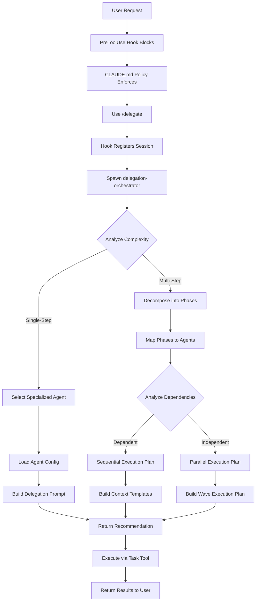

# CLAUDE.md

This file provides guidance to Claude Code when working with the Claude Code Delegation System.

---

## CRITICAL: Delegation Policy

**MANDATORY IMMEDIATE DELEGATION ON TOOL BLOCK**

When ANY tool is blocked by the delegation policy hook:

1. **DO NOT try alternative approaches** (different tools, workarounds, etc.)
2. **DO NOT explain what you tried** - just delegate immediately
3. **IMMEDIATELY use `/delegate <task>`** on first tool block
4. **The entire user request must be delegated**, not just the blocked tool

### Recognition Pattern

```
Error: PreToolUse:* hook error: [...] 🚫 Tool blocked by delegation policy
Tool: <ToolName>

⚠️ STOP: Do NOT try alternative tools.
✅ REQUIRED: Use /delegate command immediately:
   /delegate <full task description>
```

When you see this error pattern, **stop immediately** and delegate the entire task.

### Correct vs Incorrect Examples

**Example - WRONG:**
```
❌ Read blocked → Try Glob → Glob blocked → Try Grep → Grep blocked → Finally delegate
```

**Example - CORRECT:**
```
✅ Read blocked → Immediately use: /delegate <full task description>
```

### The Delegation Flow


### Key Points

- **First tool block = immediate delegation** - Don't try alternatives
- **Delegate the entire user request** - Not just the blocked operation
- **Follow the error message instructions** - They tell you exactly what to do
- **Session registration happens automatically** - First `/delegate` marks session as delegated
- **Specialized agents handle execution** - Orchestrator routes to expert agents

---

## Commands

### Installation

```bash
# Copy configuration to Claude Code directory
cp -r agents commands hooks system-prompts scripts settings.json ~/.claude/

# Make hooks executable
chmod +x ~/.claude/hooks/PreToolUse/require_delegation.sh
chmod +x ~/.claude/hooks/UserPromptSubmit/clear-delegation-sessions.sh
chmod +x ~/.claude/hooks/PostToolUse/python_posttooluse_hook.sh
chmod +x ~/.claude/hooks/stop/python_stop_hook.sh
chmod +x ~/.claude/scripts/statusline.sh

# Verify installation
ls -la ~/.claude/hooks/PreToolUse/require_delegation.sh
```

### Usage

**Single-Step Delegation:**
```bash
/delegate Create a calculator module with add, subtract, multiply, divide functions
```

**Multi-Step Workflows (with orchestration):**
```bash
claude --append-system-prompt "$(cat ~/.claude/system-prompts/workflow_orchestrator.md)" \
  "Create calculator.py with tests and verify they pass"
```

**Read-Only Questions:**
```bash
/ask How does the authentication system work?
/ask What database is configured? haiku
/ask Explain the API architecture opus
```

**Pre-Commit Quality Checks:**
```bash
/pre-commit
/pre-commit haiku
```

The `/pre-commit` command runs comprehensive code quality checks before committing:
- **Python validation:** Ruff linting and Pyright type checking
- **Security scanning:** Critical vulnerability detection
- **Hook testing:** Validates all hook scripts for syntax and security
- **Standards compliance:** Enforces project coding standards

### Debug Commands

**Enable Debug Logging:**
```bash
export DEBUG_DELEGATION_HOOK=1
tail -f /tmp/delegation_hook_debug.log
```

**Emergency Bypass (Disable Delegation):**
```bash
export DELEGATION_HOOK_DISABLE=1
claude "your command"
```

**Check Delegation State:**
```bash
cat .claude/state/delegated_sessions.txt
```

---

## Architecture Overview

### Hook System

The delegation system uses a 6-hook architecture:

| Hook | Trigger | Purpose |
|------|---------|---------|
| **SessionStart** | Session begins | Log session initialization |
| **UserPromptSubmit** | Before user message | Clear delegation state (security) |
| **PreToolUse** | Before tool invocation | Enforce allowlist, register sessions |
| **PostToolUse** | After Write/Edit | Validate Python code (Ruff, Pyright) |
| **SubagentStop** | Subagent completes | Update parallel execution state |
| **Stop** | Session ends | Cleanup, remove stale sessions |

**PreToolUse Allowlist:** `AskUserQuestion`, `TodoWrite`, `SlashCommand`, `Task`/`SubagentTask`/`AgentTask`

**All other tools:** BLOCKED unless session is registered in `.claude/state/delegated_sessions.txt`

**Hook Lifecycle:**
```
SessionStart → UserPromptSubmit → PreToolUse → Tool → PostToolUse → SubagentStop → Stop
```

### Agent Orchestration

The system uses a two-stage delegation architecture:

**Stage 1: Orchestration (Analysis & Planning)**
- **Agent:** `delegation-orchestrator`
- **Location:** `~/.claude/agents/delegation-orchestrator.md`
- **Responsibilities:**
  - Task complexity analysis (single-step vs multi-step)
  - Agent selection via keyword matching (≥2 matches threshold)
  - Configuration loading from agent `.md` files
  - Prompt construction with agent system prompts
  - Context passing template creation for multi-step workflows
  - Execution mode selection (sequential vs parallel)

**Stage 2: Execution (Delegation)**
- **Process:**
  - Parse orchestrator's recommendation
  - Extract delegation prompt from code fences
  - Spawn specialized agent via `Task` tool
  - Capture results and pass context to next phase (if multi-step)
  - Update TodoWrite task list after each phase

**Complete Flow:**


### State Management

**Session Registry** (`.claude/state/delegated_sessions.txt`)
- **Format:** One session ID per line
- **Lifecycle:** Created on first delegation, cleared on next user prompt
- **Cleanup:** Sessions older than 1 hour automatically removed
- **Purpose:** Tracks which sessions have delegation privileges

**Active Delegations** (`.claude/state/active_delegations.json`)
- **Format:** JSON with workflow_id, active_delegations array
- **Purpose:** Track concurrent subagent sessions in parallel workflows
- **Schema version:** 2.0

**State Machine:**
```
[User Prompt] → [Clear State] → [Main Claude Receives]
      ↓
[Attempt Tool] → [PreToolUse Hook]
      ↓
Is session in delegated_sessions.txt?
      ├─ YES → Allow tool
      └─ NO → Is tool in allowlist?
            ├─ YES (Task/SubagentTask/AgentTask/SlashCommand) → Register session, allow
            ├─ YES (TodoWrite/AskUserQuestion) → Allow
            └─ NO → BLOCK
```

### Session Inheritance Mechanism

Tool access privileges propagate from parent session to subagents:

1. **Registration:** `/delegate` registers parent session ID in `.claude/state/delegated_sessions.txt`
2. **Spawning:** `Task` tool registers subagent session ID (different from parent)
3. **Inheritance:** Subagents can use all tools and spawn nested subagents (recursive)
4. **Cleanup:** UserPromptSubmit clears ALL registrations; Stop hook removes stale sessions (>1 hour)

**Security:** No persistent privilege, explicit delegation required, transparent logging in DEBUG mode.

### StatusLine System

Real-time status display for workflow execution showing execution mode, active subagents, and wave information.

For complete documentation, see [docs/statusline-system.md](docs/statusline-system.md).

---

## Agent Capabilities

### 11 Specialized Agents

The system provides domain-expert agents with keyword-based activation:

| Agent | Keywords | Capabilities |
|-------|----------|--------------|
| **delegation-orchestrator** | delegate, orchestrate, route task | Meta-agent for task analysis and routing |
| **codebase-context-analyzer** | analyze, understand, explore, architecture, patterns, structure, dependencies | Read-only code exploration and architecture analysis |
| **tech-lead-architect** | design, approach, research, evaluate, best practices, architect, scalability, security | Solution design and architectural decisions |
| **task-completion-verifier** | verify, validate, test, check, review, quality, edge cases | Testing, QA, validation |
| **code-cleanup-optimizer** | refactor, cleanup, optimize, improve, technical debt, maintainability | Refactoring and code quality improvement |
| **code-reviewer** | review, code review, critique, feedback, assess quality, evaluate code | Code review and quality assessment |
| **devops-experience-architect** | setup, deploy, docker, CI/CD, infrastructure, pipeline, configuration | Infrastructure, deployment, containerization |
| **documentation-expert** | document, write docs, README, explain, create guide, documentation | Documentation creation and maintenance |
| **dependency-manager** | dependencies, packages, requirements, install, upgrade, manage packages | Dependency management (Python/UV focused) |
| **task-decomposer** | plan, break down, subtasks, roadmap, phases, organize, milestones | Project planning and task breakdown |
| **phase-validator** | validate, verify phase, check completion, phase criteria | Phase completion validation, deliverable verification |

### Agent Selection Algorithm

**From delegation-orchestrator:**

1. **Extract Keywords:** Parse task description (case-insensitive), tokenize into words
2. **Count Matches:** For each agent, count activation keyword matches in task
3. **Apply Threshold:** Select agent with ≥2 keyword matches (highest count wins)
4. **Record Rationale:** Document which keywords matched

**Examples:**

**Task:** "Analyze the authentication system architecture"
- Keywords in task: "analyze", "authentication", "system", "architecture"
- codebase-context-analyzer matches: analyze=1, architecture=1 = **2 matches**
- **Selected:** codebase-context-analyzer

**Task:** "Refactor auth module to improve maintainability"
- Keywords in task: "refactor", "improve", "maintainability"
- code-cleanup-optimizer matches: refactor=1, improve=1, maintainability=1 = **3 matches**
- **Selected:** code-cleanup-optimizer

**Task:** "Create a new utility function"
- No agent reaches 2 matches
- **Selected:** general-purpose (no specialized agent)

### Agent Configuration Loading

**Step-by-step process:**

1. **Construct Path:** `~/.claude/agents/{agent-name}.md`
2. **Load File:** Use Read tool to load agent file
3. **Parse Structure:**
   - Lines 1-N (between `---` markers): YAML frontmatter (metadata)
   - Lines N+1 to EOF: System prompt content
4. **Extract System Prompt:** Everything after second `---` marker becomes agent's instructions
5. **Construct Delegation Prompt:**

**For specialized agent:**
```
[Agent System Prompt from file]

---

TASK: [User's task description with objectives]
```

**For general-purpose:**
```
[User's task description with objectives]
```

### Agent Tool Restrictions

Agents have restricted tool sets declared in frontmatter (`tools: ["Tool1", "Tool2"]`):

| Agent Type | Tools | Restrictions |
|------------|-------|--------------|
| **Read-Only** (analyzer, reviewer) | Read, Glob, Grep, Bash | No Write/Edit, no Task |
| **Implementation** (optimizer, devops) | Read, Write, Edit, Glob, Grep, Bash | No Task (prevents recursion) |
| **Meta-Agents** (orchestrator, decomposer) | Read, Task, TodoWrite | No direct code modification |
| **Verification** (task-completion-verifier, phase-validator) | Read, Bash, Glob, Grep | No modification (objectivity) |

All agents have implicit access to `AskUserQuestion` for clarifications.

---

## Workflow Guidelines

### Workflow Patterns

**Simple Workflow:** Single action/deliverable with automatic verification (2-phase minimum).

**Multi-Step Detection Indicators:**
- Sequential connectors: "and then", "then", "after that", "with", "including"
- Multiple verbs: "create A, write B, update C"
- Phase markers: "first... then...", "start by..."

### Execution Modes

**Sequential Execution:** Use when phases have dependencies (Phase 2 needs Phase 1's output).
- Example: "Create calculator.py with tests" - tests need the file path from implementation

**Parallel Execution:** Use when phases are independent (different files/systems, no data dependencies).
- Example: "Analyze auth system AND design payment API" - use "AND" as parallel hint
- Phases execute in waves; Wave N+1 waits for Wave N completion

**Conservative Rule:** "When in doubt, choose sequential."

### Context Passing

Between phases, always pass:
- **File paths:** Absolute paths (e.g., `/Users/user/project/calculator.py`)
- **Key decisions:** Framework choices, architectural patterns
- **Issues encountered:** Blockers and resolutions

---

## Configuration

### Settings File Structure

**File:** `/Users/nadavbarkai/dev/claude-code-workflow-orchestration/settings.json`

**Permissions (deny sensitive files):**
```json
{
  "permissions": {
    "deny": [
      "Read(**/.env*)",
      "Read(**/.pem*)",
      "Read(**/*.key)",
      "Read(**/secrets/**)",
      "Read(**/credentials/**)",
      "Read(**/.aws/**)",
      "Read(**/.ssh/**)",
      "Read(**/docker-compose*.yml)",
      "Read(**/config/database.yml)"
    ]
  }
}
```

**Hook Registration (partial example - full configuration includes all 6 hooks):**
```json
{
  "hooks": {
    "PreToolUse": [
      {
        "matcher": "*",
        "hooks": [
          {
            "type": "command",
            "command": "~/.claude/hooks/PreToolUse/require_delegation.sh",
            "timeout": 5
          }
        ]
      }
    ],
    "UserPromptSubmit": [
      {
        "hooks": [
          {
            "type": "command",
            "command": "~/.claude/hooks/UserPromptSubmit/clear-delegation-sessions.sh",
            "timeout": 2
          }
        ]
      }
    ]
  }
}
```
*Note: See `settings.json` for complete hook registration including SessionStart, PostToolUse, SubagentStop, and Stop hooks.*

### Agent File Format

**Standard structure:**
```markdown
---
name: agent-name
description: Agent description
tools: ["Tool1", "Tool2"]
color: visualization-color
activation_keywords: ["keyword1", "keyword2"]
---

# Agent System Prompt

[Complete system prompt content - this entire section is the agent's instructions]
```

**Location pattern:** `~/.claude/agents/{agent-name}.md`

**Examples:**
- `~/.claude/agents/delegation-orchestrator.md`
- `~/.claude/agents/codebase-context-analyzer.md`
- `~/.claude/agents/tech-lead-architect.md`
- `~/.claude/agents/task-completion-verifier.md`
- (... 7 more agents)

### Environment Variables

| Variable | Purpose | Default |
|----------|---------|---------|
| `DEBUG_DELEGATION_HOOK` | Enable debug logging | 0 |
| `DELEGATION_HOOK_DISABLE` | Emergency bypass | 0 |
| `CLAUDE_PROJECT_DIR` | Override project directory | `$PWD` |

For detailed documentation, usage examples, and configuration patterns, see [docs/environment-variables.md](docs/environment-variables.md).

---

## Best Practices

### Delegation Patterns

1. **Always delegate immediately** when tools are blocked
   - Don't try alternative approaches
   - Don't explain what you tried
   - Use `/delegate <full task description>` immediately

2. **Use descriptive task descriptions** for better agent selection
   - Include relevant keywords to trigger specialized agents
   - Be specific about objectives and deliverables
   - Example: "Refactor authentication module to improve maintainability" triggers code-cleanup-optimizer

3. **Enable workflow orchestration** for multi-step tasks
   - Append workflow_orchestrator system prompt
   - Ensures context passing between phases
   - Provides TodoWrite tracking

4. **Trust the orchestrator** for agent selection
   - Keyword matching algorithm is intelligent (≥2 matches)
   - Specialized agents have domain expertise
   - Falls back to general-purpose if no strong match

### Multi-Step Workflow Patterns

5. **Trust execution mode selection**
   - Orchestrator analyzes phase dependencies intelligently
   - Sequential: Phases with data dependencies
   - Parallel: Independent phases with resource isolation
   - Conservative fallback when uncertain

6. **Capture comprehensive context** between phases
   - File paths: Always absolute (e.g., `/Users/user/project/file.py`)
   - Key decisions: Framework choices, architecture patterns
   - Configurations: Settings, environment variables
   - Issues encountered: Blockers and resolutions

7. **Update TodoWrite after each phase/wave**
   - Provides transparency and progress tracking
   - Mark phases complete only when fully finished
   - Update status: pending → in_progress → completed

8. **Verify phase/wave results** before proceeding
   - Check that files were created at expected paths
   - Validate that decisions were implemented correctly
   - Ensure no errors occurred

9. **Use absolute paths** when referencing files
   - Example: `/Users/user/project/calculator.py`
   - Not: `./calculator.py` or `calculator.py`

10. **Understand execution modes**
    - Sequential: Phases execute one at a time with context passing
    - Parallel: Independent phases execute concurrently in waves
    - Wave synchronization: Wave N+1 waits for all Phase completions in Wave N

### Error Handling Patterns

11. **Stop at phase/wave failures**
    - Don't proceed if a phase fails or encounters errors
    - Review error messages and fix issues
    - Re-attempt failed phase with fixes

12. **Review orchestrator recommendations**
    - Understand execution mode (sequential vs parallel)
    - Verify phase dependencies make sense
    - Check agent selections are appropriate

13. **Use emergency bypass sparingly**
    - Only when delegation enforcement needs to be disabled
    - Example: Troubleshooting hook issues
    - Re-enable after troubleshooting complete

14. **Wave failure handling** (parallel mode)
    - Successful phases are preserved
    - Failed phases can be retried independently
    - Context from successful phases passed forward

### Agent Selection Patterns

15. **Include relevant keywords** in task descriptions
    - Example: "analyze architecture" → codebase-context-analyzer
    - Example: "refactor and optimize" → code-cleanup-optimizer
    - Example: "test and verify" → task-completion-verifier

16. **Check agent capabilities** in `commands/delegate.md`
    - Lists all 11 specialized agents
    - Shows activation keywords for each
    - Describes key capabilities and use cases

17. **Let orchestrator select agents**
    - Uses keyword matching with ≥2 match threshold
    - Considers match count (higher wins)
    - Falls back to general-purpose if no strong match

18. **Independence indicators** for parallel execution
    - Use "AND" (capitalized) to hint at parallel-safe phases
    - Example: "Analyze auth system AND design payment API"
    - Orchestrator analyzes dependencies to confirm

---

## Troubleshooting

### Tools Are Blocked But Delegation Fails

**Symptoms:**
- PreToolUse hook blocks tools correctly
- `/delegate` command doesn't work
- Orchestrator not found

**Diagnosis:**
```bash
# Check settings.json location
ls ~/.claude/settings.json

# Verify hook scripts are executable
ls -la ~/.claude/hooks/PreToolUse/require_delegation.sh

# Check agent files exist
ls ~/.claude/agents/
```

**Solutions:**
```bash
# Reinstall configuration
cp -r agents commands hooks system-prompts scripts settings.json ~/.claude/

# Make hooks executable
chmod +x ~/.claude/hooks/PreToolUse/require_delegation.sh
chmod +x ~/.claude/hooks/UserPromptSubmit/clear-delegation-sessions.sh
```

### Agent Not Found Error

**Symptoms:**
- `/delegate` executes but agent file not found
- Error: "Could not read agent configuration"

**Diagnosis:**
```bash
# List available agents
ls ~/.claude/agents/

# Check specific agent file
cat ~/.claude/agents/delegation-orchestrator.md
```

**Solutions:**
```bash
# Verify agent filename matches delegation request
# Agent files should be in ~/.claude/agents/
# Filenames should match agent names (kebab-case)

# Copy missing agents
cp agents/*.md ~/.claude/agents/
```

### Multi-Step Workflow Not Detected

**Symptoms:**
- Task has multiple steps but treated as single-step
- No TodoWrite task list created
- Context not passed between phases

**Diagnosis:**
```bash
# Check if workflow_orchestrator system prompt is appended
# Task description should contain multi-step indicators
```

**Solutions:**
```bash
# Append workflow_orchestrator system prompt
claude --append-system-prompt "$(cat ~/.claude/system-prompts/workflow_orchestrator.md)" \
  "Create calculator.py with tests and verify they pass"

# Use multi-step keywords in task description
# Sequential connectors: "and then", "with", "including"
# Compound indicators: "with [noun]", "and [verb]"
# Phase markers: "first... then...", "start by... then..."
```

### Debug Mode Not Working

**Symptoms:**
- `DEBUG_DELEGATION_HOOK=1` set but no log file
- Log file empty or not updating

**Diagnosis:**
```bash
# Check environment variable
echo $DEBUG_DELEGATION_HOOK

# Check log file location
ls -la /tmp/delegation_hook_debug.log

# Check hook script has debug code
grep DEBUG_HOOK ~/.claude/hooks/PreToolUse/require_delegation.sh
```

**Solutions:**
```bash
# Enable debug mode
export DEBUG_DELEGATION_HOOK=1

# Trigger a tool call to generate log entries
/delegate test task

# Tail log file
tail -f /tmp/delegation_hook_debug.log
```

### Session Registry Issues

**Symptoms:**
- Tools blocked even after successful delegation
- Session not registered in delegated_sessions.txt

**Diagnosis:**
```bash
# Check state directory exists
ls -la .claude/state/

# Check delegated sessions file
cat .claude/state/delegated_sessions.txt

# Check file age (auto-cleanup after 1 hour)
stat .claude/state/delegated_sessions.txt
```

**Solutions:**
```bash
# Manually create state directory if missing
mkdir -p .claude/state

# Clear stale sessions
rm -f .claude/state/delegated_sessions.txt

# Re-delegate to register session
/delegate <task>
```

### Parallel Execution Not Triggering

**Symptoms:**
- Task seems parallel-safe but executes sequentially
- No wave execution in active_delegations.json

**Diagnosis:**
```bash
# Check task description for parallel hints
# Look for "AND" (capitalized) keyword
# Verify phases are truly independent (no data dependencies)

# Check active delegations file
cat .claude/state/active_delegations.json
```

**Solutions:**
```bash
# Use explicit parallel indicators
# Example: "Analyze auth system AND design payment API"

# Verify phases are independent:
# - No data dependencies
# - Different files/resources
# - No file modification conflicts

# Trust orchestrator's conservative fallback
# Sequential is safer when dependencies unclear
```

### Hook Debugging Guide

For comprehensive debugging procedures for all 6 delegation system hooks, see [docs/hook-debugging.md](docs/hook-debugging.md).

**Quick debugging steps:**
1. Verify hook installation: `ls -la ~/.claude/hooks/*/`
2. Test hook syntax: `bash -n <hook_script>`
3. Enable debug logging: `export DEBUG_DELEGATION_HOOK=1`
4. Check hook registration: `cat ~/.claude/settings.json | jq '.hooks'`

---

## File Reference

### Hook Scripts
- `/Users/nadavbarkai/dev/claude-code-workflow-orchestration/hooks/PreToolUse/require_delegation.sh` - Tool blocking enforcement
- `/Users/nadavbarkai/dev/claude-code-workflow-orchestration/hooks/UserPromptSubmit/clear-delegation-sessions.sh` - State cleanup
- `/Users/nadavbarkai/dev/claude-code-workflow-orchestration/hooks/PostToolUse/python_posttooluse_hook.sh` - Post-tool operations
- `/Users/nadavbarkai/dev/claude-code-workflow-orchestration/hooks/stop/python_stop_hook.sh` - Cleanup on exit
- `/Users/nadavbarkai/dev/claude-code-workflow-orchestration/hooks/SessionStart/session_start_hook.sh` - Session initialization logging
- `/Users/nadavbarkai/dev/claude-code-workflow-orchestration/hooks/SubagentStop/subagent_stop_hook.sh` - Parallel execution state updates

### Agent Configurations
- `/Users/nadavbarkai/dev/claude-code-workflow-orchestration/agents/delegation-orchestrator.md` - Meta-agent for routing
- `/Users/nadavbarkai/dev/claude-code-workflow-orchestration/agents/codebase-context-analyzer.md` - Code analysis (read-only)
- `/Users/nadavbarkai/dev/claude-code-workflow-orchestration/agents/tech-lead-architect.md` - Solution design
- `/Users/nadavbarkai/dev/claude-code-workflow-orchestration/agents/task-completion-verifier.md` - Testing, QA
- `/Users/nadavbarkai/dev/claude-code-workflow-orchestration/agents/code-cleanup-optimizer.md` - Refactoring
- `/Users/nadavbarkai/dev/claude-code-workflow-orchestration/agents/code-reviewer.md` - Code review
- `/Users/nadavbarkai/dev/claude-code-workflow-orchestration/agents/devops-experience-architect.md` - Infrastructure, CI/CD
- `/Users/nadavbarkai/dev/claude-code-workflow-orchestration/agents/documentation-expert.md` - Documentation
- `/Users/nadavbarkai/dev/claude-code-workflow-orchestration/agents/dependency-manager.md` - Package management
- `/Users/nadavbarkai/dev/claude-code-workflow-orchestration/agents/task-decomposer.md` - Project planning
- `/Users/nadavbarkai/dev/claude-code-workflow-orchestration/agents/phase-validator.md` - Phase validation

### Command Definitions
- `/Users/nadavbarkai/dev/claude-code-workflow-orchestration/commands/delegate.md` - Intelligent delegation command
- `/Users/nadavbarkai/dev/claude-code-workflow-orchestration/commands/ask.md` - Read-only question answering
- `/Users/nadavbarkai/dev/claude-code-workflow-orchestration/commands/pre-commit.md` - Pre-commit checks

### System Prompts
- `/Users/nadavbarkai/dev/claude-code-workflow-orchestration/system-prompts/workflow_orchestrator.md` - Multi-step workflow orchestration

### Configuration
- `/Users/nadavbarkai/dev/claude-code-workflow-orchestration/settings.json` - Hook registration, permissions
- `/Users/nadavbarkai/dev/claude-code-workflow-orchestration/CLAUDE.md` - Project delegation policy (this file)
- `/Users/nadavbarkai/dev/claude-code-workflow-orchestration/README.md` - User-facing documentation

### State Files (Runtime)
- `.claude/state/delegated_sessions.txt` - Session registry
- `.claude/state/active_delegations.json` - Parallel execution tracking

### Debug Logs
- `/tmp/delegation_hook_debug.log` - Hook debug output (when DEBUG_DELEGATION_HOOK=1)

---

## Python Coding Standards

For complete Python coding standards enforced by this project, see [docs/python-coding-standards.md](docs/python-coding-standards.md).

**Key requirements:**
- Python 3.12+
- Modern type hints (`list[str]` not `List[str]`, `str | None` not `Optional[str]`)
- No print statements (use logging)
- Security: No exec/eval, no pickle, use secrets not random
