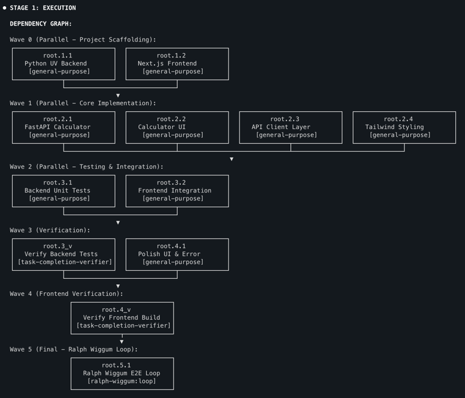
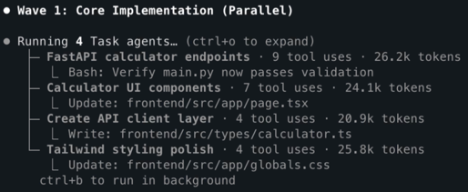

# Claude Code Workflow Orchestration System

A hook-based framework for Claude Code that enforces task delegation to specialized agents, enabling structured workflows and expert-level task handling through intelligent orchestration.

See the delegation system in action:


## Overview

This system uses Claude Code's hook mechanism to create a delegation-enforced workflow architecture that routes tasks to specialized agents for expert-level execution.

### Key Features

- **Enforced Delegation** - PreToolUse hooks block direct tool usage, forcing delegation to specialized agents
- **8 Specialized Agents** - Each agent has domain expertise (code cleanup, testing, architecture, DevOps, etc.)
- **Unified Task Planner** - Single `task-planner` skill handles planning, agent selection, and execution orchestration
- **Intelligent Multi-Step Workflows** - Sequential execution for dependent phases, parallel for independent phases
- **Isolated Subagent Sessions** - Each delegation spawns independent session with custom system prompts
- **Progress Tracking** - Tasks API (TaskCreate/TaskUpdate/TaskList) provides visible task list throughout workflow execution
- **Stateful Session Management** - Fresh delegation enforcement per user message with session registry
- **Smart Dependency Analysis** - Automatically analyzes phase dependencies to determine optimal execution mode
- **Parallel Execution Support** - Executes independent phases concurrently with automatic wave synchronization
- **Visualization & Debugging** - Comprehensive logging and debug tools for understanding delegation decisions

### Execution Model

The system uses a two-stage execution pipeline:

**Stage 0: Planning & Analysis (task-planner skill)**
- Analyzes task complexity (single-step vs multi-step)
- Decomposes complex tasks into atomic phases
- Performs dependency analysis to determine execution mode
- Assigns specialized agents via keyword matching
- Creates wave assignments for parallel/sequential execution
- Creates tasks via TaskCreate with structured metadata

**Stage 1: Execution**
- **Single-Step Tasks:** Hook blocks tools → Delegates to specialized agent → Agent executes → Results returned
- **Multi-Step Workflows:**
  - **Sequential:** Dependent phases execute one at a time, passing context forward
  - **Parallel:** Independent phases execute concurrently in waves for time efficiency
- Results consolidated and summary provided

**Execution Mode Selection:** The task-planner intelligently chooses between sequential (context preservation, dependencies) and parallel (time savings, independence) based on phase dependency analysis.


## Quick Start

### Prerequisites

#### macOS / Linux
- uv: https://docs.astral.sh/uv/getting-started/installation/
```bash
curl -LsSf https://astral.sh/uv/install.sh | sh
```

- bun: https://bun.com/docs/installation
```bash
curl -fsSL https://bun.com/install | bash
```

- jq: JSON processor for parallel workflow state tracking.
```bash
# macOS
brew install jq
# Linux
sudo apt install jq
```

#### Windows

**Python 3.12+** is required. All hooks use cross-platform Python scripts.

- Python: https://www.python.org/downloads/
  - During installation, ensure "Add Python to PATH" is checked
  - Verify installation: `python --version`

- uv: https://docs.astral.sh/uv/getting-started/installation/
```powershell
powershell -ExecutionPolicy ByPass -c "irm https://astral.sh/uv/install.ps1 | iex"
```

- bun: https://bun.sh/docs/installation
```powershell
powershell -c "irm bun.sh/install.ps1 | iex"
```

- jq (optional, for advanced parallel workflow features):
```powershell
# Using Chocolatey
choco install jq
# Or download from https://jqlang.github.io/jq/download/
```

**Note:** The hook system uses Python scripts for cross-platform compatibility. Ensure `python` is available in your PATH.

## Installation

This project provides a comprehensive delegation system for Claude Code with multi-agent orchestration. Choose your preferred installation method:

### 🔌 Plugin Installation (Recommended)

The easiest way to install is via Claude Code's plugin system:

```bash
# Add the marketplace
claude plugin marketplace add barkain/claude-code-workflow-orchestration

# Install the plugin
claude plugin install workflow-orchestrator@barkain-plugins  # user-level
# or
claude plugin install workflow-orchestrator@barkain-plugins --scope project  # project-level
```

**Benefits:**
- Automatic setup and configuration
- Easy updates via plugin manager
- No manual file copying required

**Optional Settings:**
- Run `/workflow-orchestrator:add-statusline` after installation to enable workflow status display
- The plugin includes a `technical-adaptive` output style optimized for workflow orchestration. To select it, configure `outputStyle` in your Claude Code settings (project or user level)

**Note:** Changing the output style requires restarting your Claude Code session for the change to take effect.

### 🔨 Manual Installation

For development or custom configurations:

```bash
# Clone the repository
git clone https://github.com/barkain/claude-code-workflow-orchestration.git
```

#### Project-Specific Installation (Recommended)

For project-isolated configurations or version-controlled delegation setups:

```bash
cd path/to/project
path/to/repo/install.sh  # follow the installation instructions
```

**Windows users:** The `install.sh` script requires bash (Git Bash or WSL). For Windows, we recommend using the **Plugin Installation** method above, which works natively on all platforms.

## Example Usage - Multi-Step Workflow

Once installed, the delegation hook is automatically active. Simply use Claude Code normally (Opus 4.5 is preferred):

```bash
# Multi-step workflow - enable orchestration for context passing
claude
```
and then prompt claude with:
```text
> create a simple calculator app with basic math operations.
  add a nice UI and use NextJS/Tailwind to build this out.
  the backend should be implemented in python as a modern uv project.
  add verification steps after each phase.
  add ralph loop as a final verification step
```

**What happens:**
1. First, the `task-planner` skill is invoked to:
   - Analyze task complexity (single-step vs multi-step)
   - Decompose into atomic subtasks
   - Assign specialized agents via keyword matching
   - Create wave assignments for parallel/sequential execution
   - Create tasks via TaskCreate and generate the execution plan

   


2. Once the task-planner returns, a task dependency graph is rendered and the user request is decomposed into parallel atomic subtasks:

    


3. Then, the sequential workflow with parallel subtasks can be initiated:
   - wave 0:
   
   

   - wave 1:
   
   


4. Claude's native todo list is also getting updated in each step:

    

### Emergency Bypass

Temporarily disable delegation enforcement if needed:

```bash
# From terminal (before starting Claude Code)
export DELEGATION_HOOK_DISABLE=1

# From within a Claude Code session (interactive toggle)
/bypass
```

The `/bypass` command allows toggling delegation enforcement on/off from within a Claude Code session without restarting.

## Setup Details

### Hook Configuration

The `plugin-hooks.json` configures the delegation enforcement hooks using cross-platform Python scripts:

```json
{
  "hooks": {
    "PreToolUse": [
      {
        "matcher": "*",
        "hooks": [{"type": "command", "command": "uv run --no-project --script \"${CLAUDE_PLUGIN_ROOT}/hooks/PreToolUse/require_delegation.py\""}]
      }
    ],
    "UserPromptSubmit": [
      {
        "hooks": [{"type": "command", "command": "uv run --no-project --script \"${CLAUDE_PLUGIN_ROOT}/hooks/UserPromptSubmit/clear-delegation-sessions.py\""}]
      }
    ]
  }
}
```

**Note:** All hooks use `uv run --no-project --script` for cross-platform compatibility (Windows, macOS, Linux). The `--no-project` flag allows execution without requiring a pyproject.toml, and `--script` directly runs Python scripts using uv's managed interpreter.

**PreToolUse Hook**: Intercepts every tool call and enforces delegation policy
**UserPromptSubmit Hook**: Clears delegation state between user prompts to ensure fresh enforcement
**SessionStart Hook**: Automatically appends workflow_orchestrator system prompt for seamless multi-step workflow detection

### workflow_orchestrator Requirements

Multi-step workflow orchestration requires the workflow_orchestrator system prompt to be appended:

**Automatic (via SessionStart hook):**
```json
{
  "hooks": {
    "SessionStart": [
      {
        "hooks": [
          {
            "type": "append_system_prompt",
            "path": "system-prompts/workflow_orchestrator.md"
          }
        ]
      }
    ]
  }
}
```

**What this enables:**
- Multi-step task detection via pattern matching
- Dependency analysis for execution mode selection
- Context passing between workflow phases
- Tasks API integration for progress tracking
- Wave synchronization for parallel execution


## Core Components

### 1. Delegation Hook (`hooks/PreToolUse/require_delegation.py`)

Blocks most tools and forces delegation to specialized agents. Cross-platform Python implementation.

**Allowed tools:**
- `AskUserQuestion` - Ask users for clarification
- `TaskCreate`, `TaskUpdate`, `TaskList`, `TaskGet` - Track task progress via Tasks API
- `SlashCommand` - Execute slash commands (including `/delegate`)
- `Task` - Spawn subagents

**All other tools are blocked** and show:
```
🚫 Tool blocked by delegation policy
✅ REQUIRED: Use /delegate command immediately
```

### 2. Specialized Agents (`agents/`)

8 specialized agents for different task types:

- **tech-lead-architect** - Solution design, architecture, research
- **codebase-context-analyzer** - Code exploration, architecture analysis
- **task-completion-verifier** - Validation, testing, quality assurance
- **code-cleanup-optimizer** - Refactoring, technical debt reduction
- **code-reviewer** - Code review for best practices
- **devops-experience-architect** - Infrastructure, deployment, CI/CD
- **documentation-expert** - Documentation creation and maintenance
- **dependency-manager** - Dependency management and updates

**Note:** The `delegation-orchestrator` agent has been deprecated. Its orchestration and routing functionality is now provided by the unified `task-planner` skill, which handles both planning and execution orchestration in a single pass.

### 3. Delegation Command (`commands/delegate.md`)

The `/delegate` command provides intelligent task delegation with integrated planning:

```bash
/delegate <task description>
```

**How it works:**
1. Invokes the `task-planner` skill (unified orchestration engine)
2. Task-planner analyzes task complexity and decomposes into phases
3. Performs dependency analysis to determine execution mode (sequential or parallel)
4. Assigns specialized agents via keyword matching (>=2 match threshold)
5. Creates wave assignments and execution plan
6. Creates task list via TaskCreate
7. Executes phases as directed by the plan

### 4. Workflow Orchestration System Prompt (`system-prompts/workflow_orchestrator.md`)

Enables multi-step workflow detection and preparation for complex tasks. Works in conjunction with the `task-planner` skill.

**Activate via:**
Simply start a Claude code session
```bash
claude
```

**Multi-step detection patterns:**
- Sequential connectors: "and then", "after that", "next"
- Compound indicators: "with [noun]", "including [noun]"
- Multiple verbs: "create X and test Y"

**Unified Planning & Execution:**
The `task-planner` skill handles both planning and execution orchestration:

1. **Task Decomposition** - Breaks complex tasks into atomic phases
2. **Dependency Analysis** - Analyzes phase dependencies to determine optimal execution mode
3. **Intelligent Execution Mode Selection** - Chooses between sequential and parallel execution
4. **Sequential Execution** - Dependent phases execute one at a time with context passing
5. **Parallel Execution** - Independent phases execute concurrently in waves
6. **Progress Tracking** - Tasks API maintains visible task list throughout
7. **State Management** - Wave synchronization ensures proper completion order

**Execution mode decision logic:**
- **Sequential:** When phases have data dependencies, file conflicts, or state conflicts requiring ordered execution
- **Parallel:** When phases are independent with no data dependencies, enabling time-efficient concurrent execution
- **Conservative fallback:** Sequential is chosen when dependencies are uncertain

**Complete workflow process:**
1. User submits multi-step task (detected by workflow_orchestrator patterns)
2. task-planner skill invoked to decompose and plan execution
3. Task list created via TaskCreate with all phases
4. Phase dependencies analyzed to determine execution mode
5. **Sequential Mode:** Phases execute one at a time with context passing
6. **Parallel Mode:** Independent phases grouped into waves and executed concurrently
7. Wave synchronization ensures proper completion order
8. Results consolidated with absolute file paths and summary provided

## Contributing

We welcome contributions to the Claude Code Workflow Orchestration System! Whether you're fixing bugs, adding features, or improving documentation, your help is appreciated.

### Reporting Issues

Found a bug or have a feature request? Please open a GitHub Issue with:
- Clear description of the issue or feature request
- Steps to reproduce (for bugs)
- Expected vs. actual behavior
- Your environment (Windows/macOS/Linux, Claude Code version, Python version, etc.)
- The used claude code model
- Relevant logs or screenshots if applicable

### Submitting Pull Requests

1. **Fork the repository** and create a feature branch:
   ```bash
   git checkout -b feature/your-feature-name
   ```

2. **Make your changes** following our code style guidelines (see below)

3. **Run quality checks (if applicable)** before submitting:
   ```bash
   # Format code
   uvx ruff format .

   # Lint code
   uvx ruff check --no-fix .

   # Type checking
   uvx pyright .

   # Run tests
   uv run pytest
   ```
   All checks must pass before submission.

4. **Commit with clear messages:**
   ```bash
   git commit -m "feat: description of your changes"
   ```
   Use conventional commit format: `feat:`, `fix:`, `docs:`, `refactor:`, etc.

5. **Push to your fork** and **submit a Pull Request** to the main branch with a clear description of changes

### Python Code Style Expectations

- **Python 3.12+** with modern syntax (e.g., `list[str]`, `str | None`)
- **Type hints** on all functions and variables
- **No print statements** - use structured logging with logger calls
- **Comprehensive docstrings** with examples for public APIs
- **Clear variable and function names** that reflect intent
- Automatic enforcement via Ruff (formatting), Pyright (types), and Pytest (tests)

Always run quality checks locally before submitting to catch issues early.

### We Value

- Clear, well-documented code
- Tests for new functionality
- Documentation updates for new features
- Constructive feedback and collaboration
- Diverse perspectives and creative solutions

Thank you for contributing to making Claude Code workflows even better!
