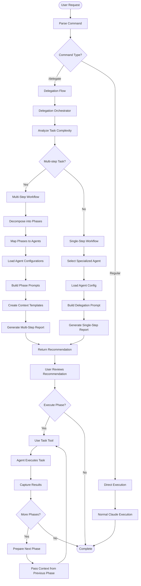
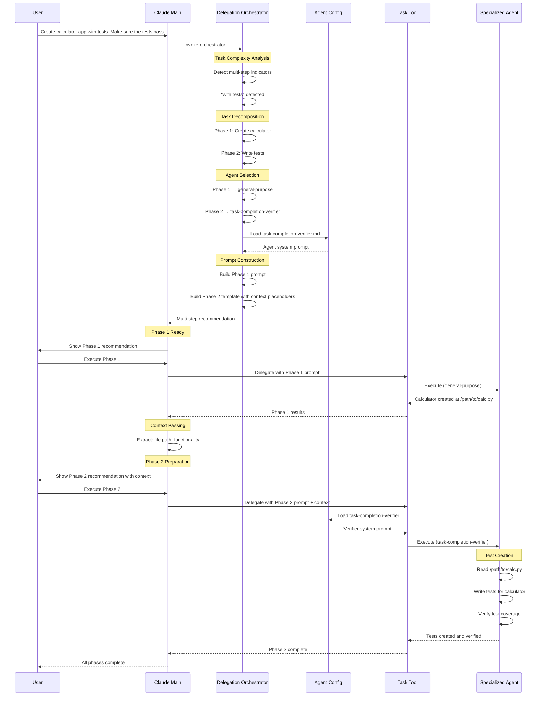

# Claude Code Delegation System

A hook-based framework for Claude Code that enforces task delegation to specialized agents, enabling structured workflows and expert-level task handling through intelligent orchestration.

See the delegation system in action:


## Overview

This system uses Claude Code's hook mechanism to create a delegation-enforced workflow architecture that routes tasks to specialized agents for expert-level execution.

### Key Features

- **Enforced Delegation** - PreToolUse hooks block direct tool usage, forcing delegation to specialized agents
- **11 Specialized Agents** - Each agent has domain expertise (code cleanup, testing, architecture, DevOps, etc.)
- **Intelligent Orchestration** - Delegation orchestrator analyzes tasks and selects optimal agents via keyword matching
- **Intelligent Multi-Step Workflows** - Sequential execution for dependent phases, parallel for independent phases
- **Isolated Subagent Sessions** - Each delegation spawns independent session with custom system prompts
- **Progress Tracking** - TodoWrite provides visible task list throughout workflow execution
- **Stateful Session Management** - Fresh delegation enforcement per user message with session registry
- **Multi-Step Workflow Orchestration** - Automatically detects and orchestrates sequential and parallel workflows with smart dependency analysis
- **Parallel Execution Support** - Executes independent phases concurrently with automatic wave synchronization
- **Visualization & Debugging** - Comprehensive logging and debug tools for understanding delegation decisions

### Execution Model

**Single-Step Tasks:**
1. User submits task → Hook blocks tools → Delegates to specialized agent → Agent executes → Results returned

**Multi-Step Workflows (Sequential or Parallel):**
1. User submits complex task → Orchestrator decomposes into phases → TodoWrite creates task list
2. Orchestrator analyzes phase dependencies to determine execution mode
3. **Sequential:** Dependent phases execute one at a time, passing context forward
4. **Parallel:** Independent phases execute concurrently in waves for time efficiency
5. Results consolidated and summary provided

**Execution Mode Selection:** The orchestrator intelligently chooses between sequential (context preservation, dependencies) and parallel (time savings, independence) based on phase dependency analysis.


## Quick Start

### Installation

**Option 1: Automated Installation (Recommended)**

```bash
./install.sh
```

The installer automatically copies all files to ~/.claude/ and makes hooks executable.

**Option 2: Project-Specific Installation**

```bash
./install.sh /path/to/your/project
```

Installs to a specific project's `.claude/` directory instead of `~/.claude/`. Useful for project-isolated configurations or version-controlled delegation setups.

### Basic Usage

Once installed, the delegation hook is automatically active. Simply use Claude Code normally:

```bash
# Multi-step workflow - enable orchestration for context passing
claude --append-system-prompt "$(cat ~/.claude/src/system-prompts/WORKFLOW_ORCHESTRATOR.md)" \
  "Create calculator.py with tests and verify they pass"
```

#### Multi-Step Workflow Examples

**Sequential Execution (dependent phases):**
```bash
# Phases have dependencies - Phase 2 needs Phase 1's output
claude --append-system-prompt "$(cat .claude/src/system-prompts/WORKFLOW_ORCHESTRATOR.md)" \
  "Create calculator.py with tests and verify they pass"

# What happens:
# 1. Phase 1: Create calculator.py
# 2. Phase 2: Write tests (uses file path from Phase 1)
# 3. Phase 3: Run tests (uses tests from Phase 2)
# Execution mode: Sequential (dependencies detected)
```

**Parallel Execution (independent phases):**
```bash
# Phases are independent - can execute concurrently
claude --append-system-prompt "$(cat .claude/src/system-prompts/WORKFLOW_ORCHESTRATOR.md)" \
  "Analyze authentication system AND design payment API"

# What happens:
# Wave 1 (Parallel): Phase A + Phase B execute concurrently
# - Phase A: Analyze auth system (codebase-context-analyzer)
# - Phase B: Design payment API (tech-lead-architect)
# Execution mode: Parallel (no dependencies detected)
# Time savings: ~50% vs sequential execution
```

**What happens:**
1. You submit a task to Claude Code
2. PreToolUse hook blocks direct tool usage
3. CLAUDE.md policy enforces immediate `/delegate` usage
4. Delegation orchestrator analyzes task complexity
5. Specialized agent(s) execute the work
6. Results are captured and summarized


### Emergency Bypass

Temporarily disable delegation enforcement if needed:

```bash
export DELEGATION_HOOK_DISABLE=1
claude "your command"
```

## Setup Details

### Hook Configuration

The `settings.json` configures the delegation enforcement hooks:

```json
{
  "hooks": {
    "PreToolUse": [
      {
        "matcher": "*",
        "hooks": [{"type": "command", "command": "./.claude/hooks/PreToolUse/require_delegation.sh"}]
      }
    ],
    "UserPromptSubmit": [
      {
        "hooks": [{"type": "command", "command": "./.claude/hooks/UserPromptSubmit/clear-delegation-sessions.sh"}]
      }
    ]
  }
}
```

**PreToolUse Hook**: Intercepts every tool call and enforces delegation policy
**UserPromptSubmit Hook**: Clears delegation state between user prompts to ensure fresh enforcement
**SessionStart Hook**: Automatically appends WORKFLOW_ORCHESTRATOR system prompt for seamless multi-step workflow detection

### WORKFLOW_ORCHESTRATOR Requirements

Multi-step workflow orchestration requires the WORKFLOW_ORCHESTRATOR system prompt to be appended:

**Automatic (via SessionStart hook):**
```json
{
  "hooks": {
    "SessionStart": [
      {
        "hooks": [
          {
            "type": "append_system_prompt",
            "path": "src/system-prompts/WORKFLOW_ORCHESTRATOR.md"
          }
        ]
      }
    ]
  }
}
```

**Manual (command-line flag):**
```bash
claude --append-system-prompt "$(cat .claude/src/system-prompts/WORKFLOW_ORCHESTRATOR.md)" \
  "Your multi-step task here"
```

**What this enables:**
- Multi-step task detection via pattern matching
- Dependency analysis for execution mode selection
- Context passing between workflow phases
- TodoWrite integration for progress tracking
- Wave synchronization for parallel execution


## Core Components

### 1. Delegation Hook (`src/hooks/PreToolUse/require_delegation.sh`)

Blocks most tools and forces delegation to specialized agents.

**Allowed tools:**
- `AskUserQuestion` - Ask users for clarification
- `TodoWrite` - Track task progress
- `SlashCommand` - Execute slash commands (including `/delegate`)
- `Task` - Spawn subagents

**All other tools are blocked** and show:
```
🚫 Tool blocked by delegation policy
✅ REQUIRED: Use /delegate command immediately
```

### 2. Specialized Agents (`src/agents/`)

11 specialized agents for different task types:

- **delegation-orchestrator** - Analyzes tasks and routes to appropriate agents
- **tech-lead-architect** - Solution design, architecture, research
- **codebase-context-analyzer** - Code exploration, architecture analysis
- **task-decomposer** - Project planning, task breakdown
- **task-completion-verifier** - Validation, testing, quality assurance
- **code-cleanup-optimizer** - Refactoring, technical debt reduction
- **code-reviewer** - Code review for best practices
- **devops-experience-architect** - Infrastructure, deployment, CI/CD
- **documentation-expert** - Documentation creation and maintenance
- **dependency-manager** - Dependency management and updates
- **phase-validator** - Phase completion validation, deliverable verification, quality gates

### 3. Delegation Command (`src/commands/delegate.md`)

The `/delegate` command provides intelligent task delegation:

```bash
/delegate <task description>
```

**How it works:**
1. Spawns the `delegation-orchestrator` agent
2. Orchestrator analyzes task complexity (single-step vs multi-step)
3. Selects appropriate specialized agent(s)
4. Constructs optimized delegation prompt
5. Returns recommendation for execution

### 4. Workflow Orchestration System Prompt (`src/system-prompts/WORKFLOW_ORCHESTRATOR.md`)

Enables multi-step workflow orchestration for complex tasks.

**Activate via:**
```bash
claude --append-system-prompt "$(cat ./src/system-prompts/WORKFLOW_ORCHESTRATOR.md)"
```

**Multi-step detection patterns:**
- Sequential connectors: "and then", "after that", "next"
- Compound indicators: "with [noun]", "including [noun]"
- Multiple verbs: "create X and test Y"

**Workflow execution model:**
1. **Intelligent Execution Mode Selection** - Orchestrator analyzes phase dependencies
2. **Sequential Execution** - Dependent phases execute one at a time with context passing
3. **Parallel Execution** - Independent phases execute concurrently in waves
4. **Progress Tracking** - TodoWrite maintains visible task list throughout
5. **State Management** - Wave synchronization ensures proper completion order

**Note**: The system intelligently chooses execution mode based on phase dependency analysis. Sequential execution is used when phases have data dependencies or file conflicts, ensuring proper context passing and error handling. Parallel execution is used when phases are independent, significantly reducing total execution time while maintaining correctness.

**Workflow orchestration process:**
1. Detects multi-step patterns in user request
2. Creates TodoWrite task list with all phases
3. Analyzes phase dependencies and determines execution mode
4. **Sequential Mode:** Delegates phases one at a time with context passing
5. **Parallel Mode:** Groups independent phases into waves, executes waves concurrently
6. Synchronizes between waves, aggregates results
7. Provides consolidated summary with absolute paths


## Usage

This section provides comprehensive guidance on how to use the delegation system effectively. You'll learn how the system processes your requests from initial submission through specialized agent execution, understand the visual flowcharts that illustrate the system's architecture, and see practical examples of delegation patterns for both simple and complex workflows.

The delegation system orchestrates a sophisticated workflow from user request through specialized agent execution. Here's the complete flow:

### Complete Delegation Flow

1. **User prompts normally** - Submit any task request to Claude Code
2. **WORKFLOW_ORCHESTRATOR detects patterns** - System prompt analyzes for multi-step indicators
3. **TodoWrite creates task list** - Phases are tracked and organized
4. **Tool attempts blocked by PreToolUse hook** - Direct tool usage is intercepted
5. **CLAUDE.md policy enforces immediate delegation** - Instructions require `/delegate` usage
6. **Hook registers session** - First `/delegate` usage marks session as delegated
7. **Orchestrator analyzes and recommends** - Task complexity determines single vs multi-step approach
8. **Main Claude executes phases** - Tools are allowed but delegation pattern continues
9. **Context passes between phases** - Results flow forward through workflow

### High-Level Mechanism Flowchart

This flowchart illustrates the complete decision tree and execution flow of the delegation system, showing how user requests are analyzed, routed, and executed sequentially through specialized agents.

**How to read this chart:**
- **Start point**: User submits a request to Claude Code
- **Decision diamonds**: Key decision points (command type detection, multi-step analysis, phase continuation)
- **Process rectangles**: Actions taken by the system (orchestration, analysis, prompt building)
- **Flow paths**: The path taken depends on whether the task is a delegation command or regular execution, and whether it's single-step or multi-step

**Key insights:**
- The system differentiates between `/delegate` commands and regular requests at the entry point
- Task complexity analysis determines whether to use single-step or multi-step workflow
- Multi-step workflows involve decomposition into phases with dependency analysis
- **Execution mode selection**: Orchestrator analyzes phase dependencies to choose sequential or parallel execution
- **Sequential mode**: Phases with dependencies execute one at a time with context passing
- **Parallel mode**: Independent phases execute concurrently in waves for time efficiency
- Single-step workflows directly select an agent and build a delegation prompt
- User reviews recommendations before execution, maintaining control over the workflow
- Each delegation spawns an isolated subagent session
- Context aggregation: Wave results are collected and passed to dependent phases
- TodoWrite tracks workflow progress, updating after each phase/wave completion



### Detailed Sequence: "Build calculator with tests" Example

This sequence diagram provides a concrete walkthrough of how the delegation system handles a real-world multi-step task: creating a calculator application with accompanying tests using sequential phase execution.

**How to read this chart:**
- **Participants**: The different components involved in the workflow (User, Claude Main, Orchestrator, Config, Task Tool, Specialized Agent)
- **Arrows**: Messages and actions flowing between components, showing the chronological sequence
- **Note boxes**: Important internal processing steps happening within a component
- **Vertical timeline**: Time flows from top to bottom, showing the sequential order of operations

**Key insights:**
- The delegation orchestrator detects "with tests" as a multi-step indicator and automatically decomposes the task into two phases
- Agent selection happens during orchestration: general-purpose for code creation, task-completion-verifier for testing
- **Dependency analysis**: Orchestrator identifies that Phase 2 depends on Phase 1's output (file path)
- **Sequential execution chosen**: Phase 1 must complete before Phase 2 begins due to dependency
- Context passing is explicit: the file path from Phase 1 is passed to Phase 2, enabling the test agent to locate and test the calculator
- Configuration loading happens just-in-time: agent system prompts are loaded only when needed for execution
- User maintains control at each phase: execution requires explicit user confirmation between phases
- Each phase spawns an isolated subagent session for task execution
- The specialized agent for Phase 2 reads the created code, writes tests, and verifies coverage before completion
- Absolute file paths ensure unambiguous references across phases
- TodoWrite tracks workflow progress, updating status as each phase completes
- **Note:** If phases were independent (e.g., "analyze auth system AND design payment API"), parallel execution would be selected instead



### Basic Delegation

When any tool is blocked, immediately delegate:

```bash
/delegate Create a calculator module with add, subtract, multiply, divide functions
```

### Multi-Step Workflows

With orchestration system prompt enabled:

```bash
# Single command triggers full workflow
/delegate Create calculator.py with comprehensive tests and run them
```

The system will:
1. Create task list via TodoWrite
2. Delegate Phase 1: Create calculator.py
3. Delegate Phase 2: Write tests (with context from Phase 1)
4. Delegate Phase 3: Run tests (with context from Phase 2)
5. Provide consolidated summary

### Ask Without Modification

Use `/ask` when you only need information:

```bash
/ask How does the authentication system work?
```

## Architecture Overview

### Execution Model

The delegation system uses an **intelligent subagent execution model** with adaptive orchestration:

**Single-Step Tasks:**
- Direct delegation to one specialized agent
- Agent executes task in isolated session
- Results captured and returned to main session

**Multi-Step Workflows:**
- **Dependency Analysis** - Orchestrator analyzes phase relationships
- **Sequential Mode** - Dependent phases execute one at a time with context passing
- **Parallel Mode** - Independent phases execute concurrently in waves
- **Context Aggregation** - Results from completed phases flow to dependent phases
- **TodoWrite Tracking** - Progress visible throughout workflow execution

**Sequential Execution (When Phases Have Dependencies):**
1. **Context Preservation** - Ensures each phase has complete context from previous phases
2. **Error Handling** - Allows workflow to stop/adjust if a phase fails
3. **Resource Management** - Prevents file/resource conflicts
4. **Debugging** - Clear linear flow makes troubleshooting easier
5. **State Consistency** - Guarantees artifact availability between phases

**Parallel Execution (When Phases Are Independent):**
1. **Time Efficiency** - Concurrent execution reduces total workflow time
2. **Wave Synchronization** - Dependent phases wait for wave completion
3. **Resource Isolation** - Independent phases operate on different resources
4. **Scalability** - Up to 4 concurrent delegations per wave
5. **Conservative Selection** - Defaults to sequential when dependencies are uncertain

**Subagent System:**
- Each delegation spawns an isolated subagent session
- Subagents have their own system prompts and tool access
- Main session orchestrates and captures results
- Session isolation prevents interference between agents

### Agent Specialization Model

The system provides 10 specialized agents, each with:
- **Keyword-based activation** - Orchestrator matches task keywords to agent capabilities
- **Custom system prompts** - Each agent has domain-specific instructions
- **Tool access control** - Agents have appropriate tool permissions
- **Expertise focus** - Narrow scope ensures high-quality specialized work

**Agent Selection Process:**
1. Orchestrator extracts keywords from task description
2. Matches keywords against agent activation keywords
3. Selects agent with ≥2 keyword matches
4. Falls back to general-purpose if no strong match
5. For multi-step: selects different agents per phase based on phase objectives

## How It Works

### The Sophisticated Hook Mechanism

The system uses **stateful session tracking** to enforce delegation:

#### On Every User Prompt (UserPromptSubmit Hook)
1. **Clears delegation state** - Deletes `.claude/state/delegated_sessions.txt`
2. **Fresh slate** - No tools are pre-allowed, forcing explicit delegation

#### On Every Tool Call (PreToolUse Hook)
1. **Checks session registry** - Is this session ID in `delegated_sessions.txt`?
2. **If YES** - Allow tool (session was previously delegated)
3. **If NO** - Check if tool is in allowlist:
   - `TodoWrite`, `AskUserQuestion` - Always allowed
   - `SlashCommand`, `Task` - Allowed AND **registers session as delegated**
   - Everything else - **BLOCKED**

#### The Session Registration Key Insight

When `/delegate` is invoked:
1. SlashCommand tool is called
2. **Hook registers the calling session ID** in `delegated_sessions.txt`
3. **Main session is now "delegated"** - can use tools freely
4. But WORKFLOW_ORCHESTRATOR prompt instructs continued delegation per phase

### Example: "Build calculator app and then write tests for it and verify"

**Step-by-step execution:**

```
1. UserPromptSubmit Hook
   └─ Clears delegated_sessions.txt (fresh state)

2. User Message: "build calculator app and then write tests..."
   └─ Main Claude receives prompt
   └─ WORKFLOW_ORCHESTRATOR detects "and then" (multi-step)
   └─ Uses TodoWrite (ALLOWED) to create 3-phase task list

3. Main Claude tries Write tool
   └─ PreToolUse hook fires
   └─ Session NOT in delegated_sessions.txt
   └─ Write NOT in allowlist
   └─ ❌ BLOCKED: "Use /delegate immediately"

4. Main Claude follows CLAUDE.md policy
   └─ Invokes: /delegate build calculator app...
   └─ SlashCommand is ALLOWED
   └─ ✅ Hook REGISTERS main session in delegated_sessions.txt
   └─ Main session now "delegated"

5. /delegate command executes
   └─ Spawns delegation-orchestrator via Task (ALLOWED)
   └─ Orchestrator analyzes: 3-phase multi-step workflow
   └─ Returns recommendation with Phase 1 prompt

6. Main Claude can now use tools directly (session delegated)
   └─ BUT workflow orchestrator instructs: continue using /delegate
   └─ Updates TodoWrite: Phase 1 in_progress

7. Phase 1: /delegate [Phase 1 specific prompt]
   └─ Orchestrator routes to specialized agent
   └─ Agent creates calculator.py
   └─ Main Claude captures context: /path/to/calculator.py

8. Phase 2: /delegate [Phase 2 prompt + Phase 1 context]
   └─ Context: "calculator at /path/to/calculator.py with add/subtract/multiply/divide"
   └─ Orchestrator routes to task-completion-verifier
   └─ Agent writes tests
   └─ Main Claude updates TodoWrite: Phase 2 complete

9. Phase 3: /delegate [Phase 3 prompt + cumulative context]
   └─ Context: "tests at /path/to/test_calculator.py, calculator at /path/to/calculator.py"
   └─ Orchestrator routes to task-completion-verifier
   └─ Agent runs tests and verifies

10. Workflow Complete
    └─ Main Claude provides consolidated summary
    └─ All TodoWrite items marked complete
```

### Why This Design is Sophisticated

1. **Stateful Session Tracking**
   - Each user message starts with clean slate (UserPromptSubmit clears state)
   - First `/delegate` registers session as trusted
   - Subsequent tool calls in that session are allowed
   - Prevents accidental direct tool usage

2. **Two-Layer Enforcement**
   - **Hard Layer**: PreToolUse hook physically blocks tools
   - **Soft Layer**: WORKFLOW_ORCHESTRATOR prompt instructs delegation pattern
   - Main session CAN use tools after first delegation, but CHOOSES to continue delegating

3. **Adaptive Execution with Context Management**
   - TodoWrite tracks overall workflow progress visibly
   - **Sequential mode**: Each phase executes completely before next phase begins
   - **Parallel mode**: Independent phases execute concurrently, wave synchronization ensures proper ordering
   - Context aggregation: Results from completed phases/waves flow to dependent phases
   - Context includes: file paths, decisions, configurations, issues
   - Absolute paths ensure unambiguous references
   - Error handling at phase/wave boundaries prevents cascading failures

4. **Intelligent Orchestration**
   - delegation-orchestrator analyzes task complexity
   - Dependency analysis determines execution mode (sequential vs parallel)
   - Keyword matching selects specialized agents (≥2 matches)
   - Constructs complete prompts with agent system prompts
   - Multi-step: provides context templates and wave execution plans
   - Agent selection per phase based on phase-specific objectives

5. **Isolated Subagent Execution**
   - Each delegation spawns independent subagent session
   - Subagents have custom system prompts and tool access
   - Session isolation prevents cross-contamination
   - Main session orchestrates and captures results
   - Sequential mode: ensures resource availability between dependent phases
   - Parallel mode: up to 4 concurrent subagents per wave with resource isolation

6. **Fresh State Philosophy**
   - UserPromptSubmit ensures no privileges persist across user messages
   - Forces intentional delegation for each new request
   - Prevents workflow "leakage" between tasks
   - Session registry cleanup after 1 hour prevents stale state

## Configuration Files

### `src/settings.json`
- Hook configuration (PreToolUse, PostToolUse, UserPromptSubmit, Stop)
- Permissions (block sensitive files)
- Status line configuration

### `src/agents/*.md`
- Agent system prompts
- Agent metadata (name, description, tools, keywords)

### `src/commands/*.md`
- Slash command definitions
- Command metadata (description, allowed tools)

### `src/hooks/PreToolUse/require_delegation.sh`
- Tool blocking logic
- Delegation session tracking
- Allowed tool allowlist

### `src/system-prompts/WORKFLOW_ORCHESTRATOR.md`
- Multi-step workflow detection patterns
- Context passing protocol
- TodoWrite integration rules

## Advanced Features

### Debug Mode

Enable debug logging for the delegation hook:

```bash
export DEBUG_DELEGATION_HOOK=1
tail -f /tmp/delegation_hook_debug.log
```

### Disable Hook (Emergency)

Temporarily disable delegation enforcement:

```bash
export DELEGATION_HOOK_DISABLE=1
```

### Session Tracking

Delegation sessions are tracked in:
```
.claude/state/delegated_sessions.txt
```

Sessions are automatically cleaned up after 1 hour.

## Best Practices

### Task Delegation
1. **Always delegate immediately** when tools are blocked - don't try alternative approaches
2. **Use descriptive task descriptions** for better agent selection via keyword matching
3. **Enable workflow orchestration** for multi-step tasks to get context passing support
4. **Trust the orchestrator** - it analyzes task complexity and selects appropriate agents

### Multi-Step Workflows
5. **Trust execution mode selection** - orchestrator intelligently chooses sequential or parallel based on dependencies
6. **Capture comprehensive context** between workflow phases:
   - File paths (always absolute)
   - Key decisions made
   - Configurations determined
   - Issues encountered and resolutions
7. **Update TodoWrite after each phase/wave** - provides transparency and progress tracking
8. **Verify phase/wave results** before proceeding to dependent phases
9. **Use absolute paths** when referencing files across phases
10. **Understand execution modes**:
    - Sequential: Phases with dependencies execute in order
    - Parallel: Independent phases execute concurrently in waves for efficiency

### Error Handling
11. **Stop at phase/wave failures** - don't proceed if a phase or wave fails or encounters errors
12. **Review orchestrator recommendations** - understand execution mode and phase dependencies
13. **Use emergency bypass sparingly** - only when delegation enforcement needs to be disabled
14. **Wave failure handling** - in parallel mode, successful phases are preserved while failed phases can be retried

### Agent Selection
15. **Include relevant keywords** in task descriptions to trigger specialized agents
16. **Check agent capabilities** (in src/commands/delegate.md) to understand which keywords activate which agents
17. **Let orchestrator select agents** - it uses keyword matching with ≥2 match threshold
18. **Independence indicators** - use "AND" (capitalized) in task descriptions to hint at parallel-safe phases

## Troubleshooting

### Multi-step workflow not detected

**Symptoms:**
- Task has multiple steps but treated as single-step
- No TodoWrite task list created
- Context not passed between phases

**Solution:**
```bash
# Ensure WORKFLOW_ORCHESTRATOR system prompt is appended
claude --append-system-prompt "$(cat .claude/src/system-prompts/WORKFLOW_ORCHESTRATOR.md)" \
  "Create calculator.py with tests and verify they pass"

# Use multi-step keywords in task description:
# - Sequential connectors: "and then", "with", "including"
# - Compound indicators: "with [noun]", "and [verb]"
# - Phase markers: "first... then...", "start by... then..."
```

**Verify SessionStart hook (for automatic orchestration):**
```bash
# Check settings.json has SessionStart hook configured
grep -A 10 "SessionStart" .claude/src/settings.json

# Should contain:
# "SessionStart": [
#   {
#     "hooks": [
#       {
#         "type": "append_system_prompt",
#         "path": "src/system-prompts/WORKFLOW_ORCHESTRATOR.md"
#       }
#     ]
#   }
# ]
```

### Tools are blocked but delegation fails
- Check that `src/settings.json` is in the correct location
- Verify hook scripts are executable: `chmod +x src/hooks/PreToolUse/*.sh`
- Enable debug mode: `export DEBUG_DELEGATION_HOOK=1`

### Agent not found
- Verify agent file exists: `ls ./.claude/agents/`
- Check agent filename matches delegation request

### Multi-step workflow not detected
- Ensure orchestration system prompt is appended
- Check task uses multi-step keywords: "and then", "with", "including"

## Project Structure

```
.
├── README.md
├── CLAUDE.md                      # Project delegation policy
├── src/                           # Installable source files
│   ├── settings.json              # Claude Code configuration
│   ├── agents/                    # Specialized agent definitions
│   │   ├── delegation-orchestrator.md
│   │   ├── tech-lead-architect.md
│   │   ├── codebase-context-analyzer.md
│   │   └── ...
│   ├── commands/                  # Slash command definitions
│   │   ├── delegate.md
│   │   └── ask.md
│   ├── hooks/                     # Hook implementations
│   │   ├── PreToolUse/
│   │   │   └── require_delegation.sh
│   │   └── UserPromptSubmit/
│   │       └── clear-delegation-sessions.sh
│   ├── system-prompts/           # System prompt augmentations
│   │   └── WORKFLOW_ORCHESTRATOR.md
│   └── scripts/                  # Utility scripts
│       └── statusline.sh
└── install.sh                    # Installation script
```

## Technical Details

### Subagent Execution Model

**How Subagents Work:**
- Each `/delegate` or Task invocation spawns an isolated subagent session
- Subagent receives complete system prompt (agent-specific + task context)
- Subagent executes in separate session with full tool access
- Main session waits for subagent completion and captures results
- Session isolation ensures no cross-contamination between agents

**Execution Guarantee:**
- **Sequential mode:** Main session delegates phases one at a time, waits for completion
- **Parallel mode:** Main session delegates wave phases concurrently, waits for wave completion
- Captures results (files, decisions, context) after each phase/wave
- Context aggregation: Results from completed phases/waves flow to dependent phases
- TodoWrite updates between phases/waves provide progress visibility

**Resource Management:**
- **Sequential mode:** Only one subagent active per phase
- **Parallel mode:** Up to 4 concurrent subagents per wave
- File system state consistency maintained through dependency analysis
- Context passing ensures artifacts from completed phases available to dependent phases
- Wave synchronization prevents race conditions

### Hook Execution

**PreToolUse Hook:**
- Receives tool name and session ID via stdin JSON
- Checks against allowed tools list (AskUserQuestion, TodoWrite, SlashCommand, Task, SubagentTask, AgentTask)
- Manages delegation session registry (marks sessions as delegated)
- Returns exit code 0 (allow) or 2 (block)
- Registers session on first Task/SlashCommand usage
- Cleanup of sessions older than 1 hour

**UserPromptSubmit Hook:**
- Cleans up old delegation sessions (>1 hour)
- Clears delegated_sessions.txt to ensure fresh state
- Ensures fresh delegation enforcement for new user prompts
- Prevents privilege persistence across user messages

### Agent Selection Algorithm

The delegation-orchestrator uses keyword matching:
1. Extract keywords from task description
2. Match against agent activation keywords
3. Select agent with ≥2 keyword matches
4. Use highest match count if multiple candidates
5. Fall back to general-purpose if no match

### Context Passing Protocol

Multi-step workflows pass context via structured format:
```
Context from Phase N:
- File paths: /absolute/path/to/file.ext
- Key decisions: Framework choice, architecture pattern
- Configurations: Settings, environment variables
- Issues encountered: Blockers resolved
```
