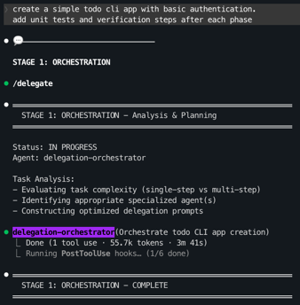
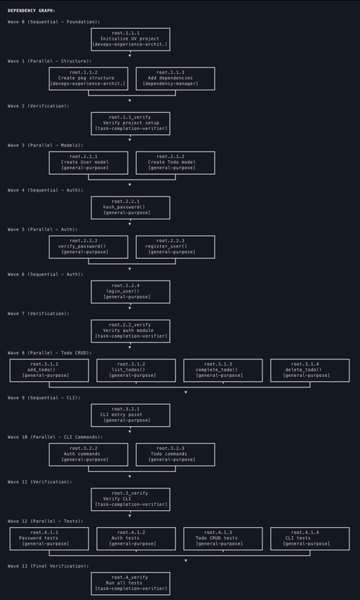
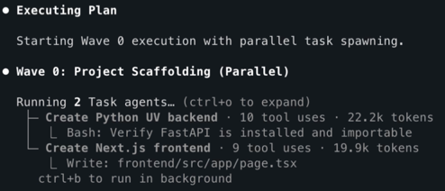
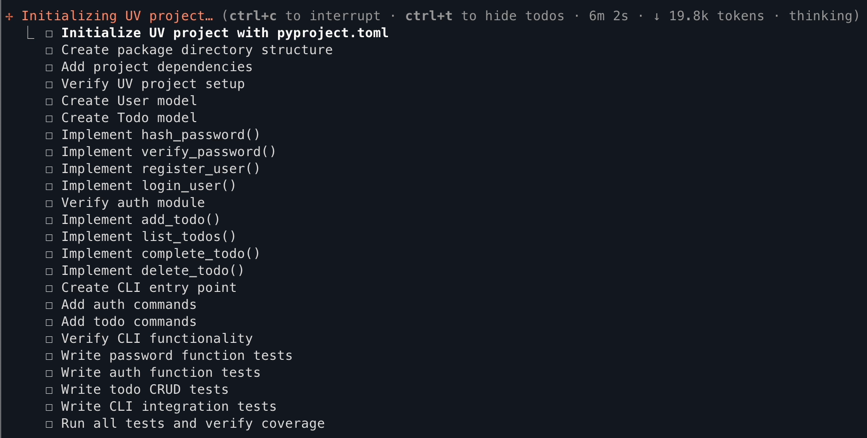

# Claude Code Workflow Orchestration System

A hook-based framework for Claude Code that enforces task delegation to specialized agents, enabling structured workflows and expert-level task handling through intelligent orchestration.

See the delegation system in action:


## Overview

This system uses Claude Code's hook mechanism to create a delegation-enforced workflow architecture that routes tasks to specialized agents for expert-level execution.

### Key Features

- **Enforced Delegation** - PreToolUse hooks block direct tool usage, forcing delegation to specialized agents
- **11 Specialized Agents** - Each agent has domain expertise (code cleanup, testing, architecture, DevOps, etc.)
- **Intelligent Orchestration** - Delegation orchestrator analyzes tasks and selects optimal agents via keyword matching
- **Intelligent Multi-Step Workflows** - Sequential execution for dependent phases, parallel for independent phases
- **Isolated Subagent Sessions** - Each delegation spawns independent session with custom system prompts
- **Progress Tracking** - TodoWrite provides visible task list throughout workflow execution
- **Stateful Session Management** - Fresh delegation enforcement per user message with session registry
- **Multi-Step Workflow Orchestration** - Automatically detects and orchestrates sequential and parallel workflows with smart dependency analysis
- **Parallel Execution Support** - Executes independent phases concurrently with automatic wave synchronization
- **Visualization & Debugging** - Comprehensive logging and debug tools for understanding delegation decisions

### Execution Model

**Single-Step Tasks:**
1. User submits task → Hook blocks tools → Delegates to specialized agent → Agent executes → Results returned

**Multi-Step Workflows (Sequential or Parallel):**
1. User submits complex task → Orchestrator decomposes into phases → TodoWrite creates task list
2. Orchestrator analyzes phase dependencies to determine execution mode
3. **Sequential:** Dependent phases execute one at a time, passing context forward
4. **Parallel:** Independent phases execute concurrently in waves for time efficiency
5. Results consolidated and summary provided

**Execution Mode Selection:** The orchestrator intelligently chooses between sequential (context preservation, dependencies) and parallel (time savings, independence) based on phase dependency analysis.


## Quick Start

### Prerequisites (macOS)
- uv: https://docs.astral.sh/uv/getting-started/installation/
```bash
curl -LsSf https://astral.sh/uv/install.sh | sh
```

- bun: https://bun.com/docs/installation
```bash
curl -fsSL https://bun.com/install | bash
```

- bc: Basic calculator for statusline percentage calculations.
```bash
brew install bc
```

- jq: JSON processor for parallel workflow state tracking.
```bash
brew install jq
```

## Installation

This project provides a comprehensive delegation system for Claude Code with multi-agent orchestration. Choose your preferred installation method:

### 🔌 Plugin Installation (Recommended)

The easiest way to install is via Claude Code's plugin system:

```bash
# Add the marketplace
claude plugin marketplace add barkain/claude-code-workflow-orchestration

# Install the plugin
claude plugin install workflow-orchestrator@barkain-plugins  # user-level
# or
claude plugin install workflow-orchestrator@barkain-plugins --scope project  # project-level
```

**Benefits:**
- Automatic setup and configuration
- Easy updates via plugin manager
- No manual file copying required

**Optional:** Run `/add-statusline` after installation to enable workflow status display.

### 🔨Manual Installation

For development or custom configurations:

```bash
# Clone the repository
git clone https://github.com/nadavbarkai/claude-code-workflow-orchestration.git
```

#### Project-Specific Installation (Recommended)

For project-isolated configurations or version-controlled delegation setups:

```bash
cd path/to/project
path/to/repo/install.sh  # follow the installation instructions
```

## Example Usage - Multi-Step Workflow

Once installed, the delegation hook is automatically active. Simply use Claude Code normally (Opus 4.5 is preferred):

```bash
# Multi-step workflow - enable orchestration for context passing
claude --append-system-prompt "$(cat ~/.claude/system-prompts/workflow_orchestrator.md)"  # user-level
#  or
claude --append-system-prompt "$(cat ./.claude/system-prompts/workflow_orchestrator.md)"  # project-level
```
and then prompt claude with:
```text
> create a simple todo cli app with basic user authentication.
the app should be implemented in python. use a standard uv project structure.
add unit tests and make sure to add verification steps after each phase
```
**Note: For optimal results, it is highly recommended to launch the claude session using the `--append-system-prompt` flag.
While the framework is functional without it, this flag ensures your orchestration instructions are prioritized at the system level, leading to significantly better instruction adherence and workflow compliance.**

**What happens:**
1. First, claude will delegate the task to the delegation-orchestrator subagent for: 
   - Evaluating task complexity (single-step vs multi-step)
   - Identifying appropriate specialized agent(s)
   - Constructing optimized delegation prompts

   

2. Once finished constructing the plan the `delegation-orchestrator` agent creates a task dependency graph and the user request is decomposed into parallel atomic subtasks:

    

3. Then, the sequential workflow with parallel subtasks can be initiated:
   
    

4. Claude's native todo list is also getting updated in each step:

    

### Emergency Bypass

Temporarily disable delegation enforcement if needed:

```bash
# From terminal (before starting Claude Code)
export DELEGATION_HOOK_DISABLE=1

# From within a Claude Code session (interactive toggle)
/bypass
```

The `/bypass` command allows toggling delegation enforcement on/off from within a Claude Code session without restarting.

## Setup Details

### Hook Configuration

The `settings.json` configures the delegation enforcement hooks:

```json
{
  "hooks": {
    "PreToolUse": [
      {
        "matcher": "*",
        "hooks": [{"type": "command", "command": "./.claude/hooks/PreToolUse/require_delegation.sh"}]
      }
    ],
    "UserPromptSubmit": [
      {
        "hooks": [{"type": "command", "command": "./.claude/hooks/UserPromptSubmit/clear-delegation-sessions.sh"}]
      }
    ]
  }
}
```

**PreToolUse Hook**: Intercepts every tool call and enforces delegation policy
**UserPromptSubmit Hook**: Clears delegation state between user prompts to ensure fresh enforcement
**SessionStart Hook**: Automatically appends workflow_orchestrator system prompt for seamless multi-step workflow detection

### workflow_orchestrator Requirements

Multi-step workflow orchestration requires the workflow_orchestrator system prompt to be appended:

**Automatic (via SessionStart hook):**
```json
{
  "hooks": {
    "SessionStart": [
      {
        "hooks": [
          {
            "type": "append_system_prompt",
            "path": "system-prompts/workflow_orchestrator.md"
          }
        ]
      }
    ]
  }
}
```

**Manual (command-line flag):**
```bash
claude --append-system-prompt "$(cat ./system-prompts/workflow_orchestrator.md)" \
  "Your multi-step task here"
```

**What this enables:**
- Multi-step task detection via pattern matching
- Dependency analysis for execution mode selection
- Context passing between workflow phases
- TodoWrite integration for progress tracking
- Wave synchronization for parallel execution


## Core Components

### 1. Delegation Hook (`hooks/PreToolUse/require_delegation.sh`)

Blocks most tools and forces delegation to specialized agents.

**Allowed tools:**
- `AskUserQuestion` - Ask users for clarification
- `TodoWrite` - Track task progress
- `SlashCommand` - Execute slash commands (including `/delegate`)
- `Task` - Spawn subagents

**All other tools are blocked** and show:
```
🚫 Tool blocked by delegation policy
✅ REQUIRED: Use /delegate command immediately
```

### 2. Specialized Agents (`agents/`)

11 specialized agents for different task types:

- **delegation-orchestrator** - Analyzes tasks and routes to appropriate agents
- **tech-lead-architect** - Solution design, architecture, research
- **codebase-context-analyzer** - Code exploration, architecture analysis
- **task-decomposer** - Project planning, task breakdown
- **task-completion-verifier** - Validation, testing, quality assurance
- **code-cleanup-optimizer** - Refactoring, technical debt reduction
- **code-reviewer** - Code review for best practices
- **devops-experience-architect** - Infrastructure, deployment, CI/CD
- **documentation-expert** - Documentation creation and maintenance
- **dependency-manager** - Dependency management and updates
- **phase-validator** - Phase completion validation, deliverable verification, quality gates

### 3. Delegation Command (`commands/delegate.md`)

The `/delegate` command provides intelligent task delegation:

```bash
/delegate <task description>
```

**How it works:**
1. Spawns the `delegation-orchestrator` agent
2. Orchestrator analyzes task complexity (single-step vs multi-step)
3. Selects appropriate specialized agent(s)
4. Constructs optimized delegation prompt
5. Returns recommendation for execution

### 4. Workflow Orchestration System Prompt (`system-prompts/workflow_orchestrator.md`)

Enables multi-step workflow orchestration for complex tasks.

**Activate via:**
```bash
claude --append-system-prompt "$(cat ./system-prompts/workflow_orchestrator.md)"
```

**Multi-step detection patterns:**
- Sequential connectors: "and then", "after that", "next"
- Compound indicators: "with [noun]", "including [noun]"
- Multiple verbs: "create X and test Y"

**Workflow execution model:**
1. **Intelligent Execution Mode Selection** - Orchestrator analyzes phase dependencies
2. **Sequential Execution** - Dependent phases execute one at a time with context passing
3. **Parallel Execution** - Independent phases execute concurrently in waves
4. **Progress Tracking** - TodoWrite maintains visible task list throughout
5. **State Management** - Wave synchronization ensures proper completion order

**Note**: The system intelligently chooses execution mode based on phase dependency analysis. Sequential execution is used when phases have data dependencies or file conflicts, ensuring proper context passing and error handling. Parallel execution is used when phases are independent, significantly reducing total execution time while maintaining correctness.

**Workflow orchestration process:**
1. Detects multi-step patterns in user request
2. Creates TodoWrite task list with all phases
3. Analyzes phase dependencies and determines execution mode
4. **Sequential Mode:** Delegates phases one at a time with context passing
5. **Parallel Mode:** Groups independent phases into waves, executes waves concurrently
6. Synchronizes between waves, aggregates results
7. Provides consolidated summary with absolute paths

## Contributing

We welcome contributions to the Claude Code Workflow Orchestration System! Whether you're fixing bugs, adding features, or improving documentation, your help is appreciated.

### Reporting Issues

Found a bug or have a feature request? Please open a GitHub Issue with:
- Clear description of the issue or feature request
- Steps to reproduce (for bugs)
- Expected vs. actual behavior
- Your environment (macOS/Linux, Claude Code version, etc.)
- The used claude code model
- Relevant logs or screenshots if applicable

### Submitting Pull Requests

1. **Fork the repository** and create a feature branch:
   ```bash
   git checkout -b feature/your-feature-name
   ```

2. **Make your changes** following our code style guidelines (see below)

3. **Run quality checks (if applicable)** before submitting:
   ```bash
   /pre-commit
   ```
   This automatically runs:
   - **Ruff** - Code formatting and linting
   - **Pyright** - Type checking
   - **Pytest** - Unit tests

   All checks must pass before submission.

4. **Commit with clear messages:**
   ```bash
   git commit -m "feat: description of your changes"
   ```
   Use conventional commit format: `feat:`, `fix:`, `docs:`, `refactor:`, etc.

5. **Push to your fork** and **submit a Pull Request** to the main branch with a clear description of changes

### Python Code Style Expectations

- **Python 3.12+** with modern syntax (e.g., `list[str]`, `str | None`)
- **Type hints** on all functions and variables
- **No print statements** - use structured logging with logger calls
- **Comprehensive docstrings** with examples for public APIs
- **Clear variable and function names** that reflect intent
- Automatic enforcement via Ruff (formatting), Pyright (types), and Pytest (tests)

Always run `/pre-commit` locally before submitting to catch issues early.

### We Value

- Clear, well-documented code
- Tests for new functionality
- Documentation updates for new features
- Constructive feedback and collaboration
- Diverse perspectives and creative solutions

Thank you for contributing to making Claude Code workflows even better!
