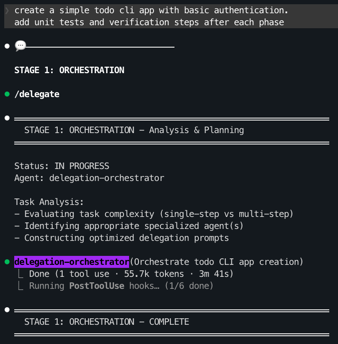
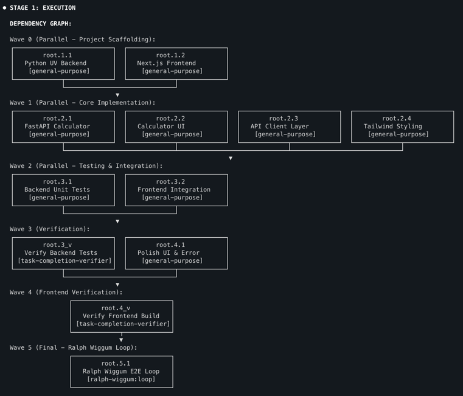
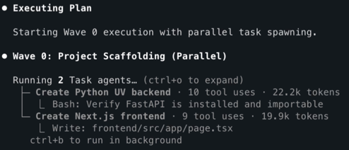
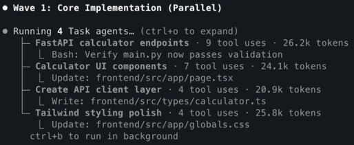
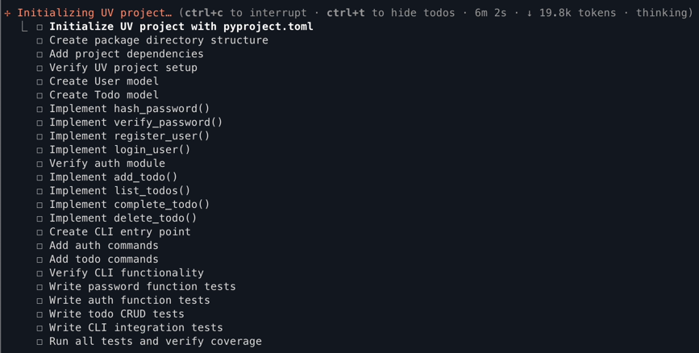

# Claude Code Workflow Orchestration System

A hook-based framework for Claude Code that enforces task delegation to specialized agents, enabling structured workflows and expert-level task handling through intelligent orchestration.

See the delegation system in action:


## 🆕 What's New

🤝 **Agent Teams Integration** — Native dual-mode execution: workflows automatically select between isolated subagents and collaborative Agent Teams (via `TeamCreate` + `Agent(team_name=...)` + `SendMessage`) based on task complexity scoring. Teammates communicate in real-time, share task lists, and self-coordinate. Enable with `CLAUDE_CODE_EXPERIMENTAL_AGENT_TEAMS=1`.

⚡ **Statusline Performance** — Cold start optimized from ~28s to <0.1s through merged API calls and non-blocking background cache refresh.

## Overview

This system uses Claude Code's hook mechanism to create a delegation-enforced workflow architecture that routes tasks to specialized agents for expert-level execution.

### Key Features

- **Enforced Delegation** - PreToolUse hooks block direct tool usage, forcing delegation to specialized agents
- **8 Specialized Agents** - Each agent has domain expertise (code cleanup, testing, architecture, DevOps, etc.)
- **Native Plan Mode** - Built-in plan mode (EnterPlanMode/ExitPlanMode) handles planning, agent selection, and execution orchestration
- **Intelligent Multi-Step Workflows** - Sequential execution for dependent phases, parallel for independent phases
- **Dual-Mode Execution** - Isolated subagent sessions (default) or collaborative Agent Teams with real-time inter-agent communication (experimental)
- **Agent Teams Integration** - Native `TeamCreate` + `Agent(team_name=...)` + `SendMessage` for peer-to-peer collaboration, shared task lists, and coordinated multi-agent workflows
- **Tasks API Integration** - Native task tracking via TaskCreate, TaskUpdate, TaskList, TaskGet with structured metadata
- **Structured Task Metadata** - Wave assignments, phase IDs, agent assignments, and dependencies encoded in task metadata
- **Async Hook Support** - Non-blocking background tasks for reminders and cleanup operations
- **Stateful Session Management** - Fresh delegation enforcement per user message with session registry
- **Smart Dependency Analysis** - Automatically analyzes phase dependencies to determine optimal execution mode
- **Parallel Execution Support** - Executes independent phases concurrently with automatic wave synchronization
- **Visualization & Debugging** - Comprehensive logging and debug tools for understanding delegation decisions

### Execution Model

The system uses a two-stage execution pipeline:

**Stage 0: Planning & Analysis (native plan mode)**
- Analyzes task complexity (single-step vs multi-step)
- Decomposes complex tasks into atomic phases
- Performs dependency analysis to determine execution mode
- Assigns specialized agents via keyword matching
- Creates wave assignments for parallel/sequential execution
- Creates tasks via TaskCreate with structured metadata

**Stage 1: Execution**
- **Single-Step Tasks:** Hook blocks tools → Delegates to specialized agent → Agent executes → Results returned
- **Multi-Step Workflows:**
  - **Subagent mode (default):** Isolated parallel Agent instances per wave. Agents return `DONE|{path}`. Context-efficient, optimal for most workflows.
  - **Team mode (experimental):** Native Agent Teams via `TeamCreate` + `Agent(team_name=...)`. Teammates share context, communicate via `SendMessage`, and self-coordinate through shared task lists. Requires `CLAUDE_CODE_EXPERIMENTAL_AGENT_TEAMS=1`.
- Results consolidated and summary provided

**Execution Mode Selection:** Plan mode calculates a `team_mode_score` to choose between subagent mode (isolated, context-efficient) and team mode (collaborative, real-time communication). For subagent mode, it further selects sequential (context preservation, dependencies) or parallel (time savings, independence) based on phase dependency analysis.


## Quick Start

### Prerequisites

#### macOS / Linux
- uv: https://docs.astral.sh/uv/getting-started/installation/
```bash
curl -LsSf https://astral.sh/uv/install.sh | sh
```

- bun: https://bun.com/docs/installation
```bash
curl -fsSL https://bun.com/install | bash
```

- jq: JSON processor for parallel workflow state tracking.
```bash
# macOS
brew install jq
# Linux
sudo apt install jq
```

#### Windows

**Python 3.12+** is required. All hooks use cross-platform Python scripts.

- Python: https://www.python.org/downloads/
  - During installation, ensure "Add Python to PATH" is checked
  - Verify installation: `python --version`

- uv: https://docs.astral.sh/uv/getting-started/installation/
```powershell
powershell -ExecutionPolicy ByPass -c "irm https://astral.sh/uv/install.ps1 | iex"
```

- bun: https://bun.sh/docs/installation
```powershell
powershell -c "irm bun.sh/install.ps1 | iex"
```

- jq (optional, for advanced parallel workflow features):
```powershell
# Using Chocolatey
choco install jq
# Or download from https://jqlang.github.io/jq/download/
```

**Note:** The hook system uses Python scripts for cross-platform compatibility. Ensure `python` is available in your PATH.

## Installation

This project provides a comprehensive delegation system for Claude Code with multi-agent orchestration. Choose your preferred installation method:

### 🔌 Plugin Installation (Recommended)

The easiest way to install is via Claude Code's plugin system:

```bash
# Add the marketplace
claude plugin marketplace add barkain/claude-code-workflow-orchestration

# Install the plugin
claude plugin install workflow-orchestrator@barkain-plugins  # user-level
# or
claude plugin install workflow-orchestrator@barkain-plugins --scope project  # project-level
```

**Benefits:**
- Automatic setup and configuration
- Easy updates via plugin manager
- No manual file copying required

**Optional Settings:**
- Run `/workflow-orchestrator:add-statusline` after installation to enable workflow status display
- The plugin includes a `technical-adaptive` output style optimized for workflow orchestration. To select it, configure `outputStyle` in your Claude Code settings (project or user level)

**Note:** Changing the output style requires restarting your Claude Code session for the change to take effect.

### 🔨 Manual Installation

For development or custom configurations:

```bash
# Clone the repository
git clone https://github.com/barkain/claude-code-workflow-orchestration.git
```

#### Project-Specific Installation (Recommended)

For project-isolated configurations or version-controlled delegation setups:

```bash
cd path/to/project
path/to/repo/install.sh  # follow the installation instructions
```

**Windows users:** The `install.sh` script requires bash (Git Bash or WSL). For Windows, we recommend using the **Plugin Installation** method above, which works natively on all platforms.

## Example Usage - Multi-Step Workflow

Once installed, the delegation hook is automatically active. Simply use Claude Code normally (Opus 4.5 is preferred):

```bash
# Multi-step workflow - enable orchestration for context passing
claude
```
and then prompt claude with:
```text
> create a simple calculator app with basic math operations.
  add a nice UI and use NextJS/Tailwind to build this out.
  the backend should be implemented in python as a modern uv project.
  add verification steps after each phase.
  add ralph loop as a final verification step
```

**What happens:**
1. First, the main agent enters native plan mode (EnterPlanMode) to:
   - Analyze task complexity (single-step vs multi-step)
   - Decompose into atomic subtasks
   - Assign specialized agents via keyword matching
   - Create wave assignments for parallel/sequential execution
   - Create tasks via TaskCreate and generate the execution plan

   

2. Once plan mode completes (ExitPlanMode), a task dependency graph is rendered and the user request is decomposed into parallel atomic subtasks:

    

3. Then, the sequential workflow with parallel subtasks can be initiated:
   - wave 0:

   

   - wave 1:

   

4. Claude's native todo list is also getting updated in each step:

    

### Emergency Bypass

Temporarily disable delegation enforcement if needed:

```bash
# From terminal (before starting Claude Code)
export DELEGATION_HOOK_DISABLE=1

# From within a Claude Code session (interactive toggle)
/workflow-orchestrator:bypass
```

The `/workflow-orchestrator:bypass` command allows toggling delegation enforcement on/off from within a Claude Code session without restarting.

## Environment Variables

The system supports several environment variables for configuration and debugging:

**Tasks API Configuration:**
```bash
CLAUDE_CODE_ENABLE_TASKS=true              # Enable Tasks API (default: true)
CLAUDE_CODE_TASK_LIST_ID=list_id           # Share task list across sessions
CLAUDE_CODE_DISABLE_BACKGROUND_TASKS=1     # Disable async background tasks
```

**Agent Teams (Experimental):**
```bash
CLAUDE_CODE_EXPERIMENTAL_AGENT_TEAMS=1     # Enable Agent Teams dual-mode execution
```

**Token Efficiency:**
```bash
CLAUDE_TOKEN_EFFICIENCY=1                  # Enable token-efficient CLI output (default: 1)
```

**Debug & Control:**
```bash
DEBUG_DELEGATION_HOOK=1                    # Enable hook debug logging
DELEGATION_HOOK_DISABLE=1                  # Emergency bypass (disable enforcement)
CLAUDE_MAX_CONCURRENT=8                    # Max parallel agents per batch (default 8)
CHECK_RUFF=0                               # Skip Ruff validation in PostToolUse
CHECK_PYRIGHT=0                            # Skip Pyright validation in PostToolUse
CLAUDE_SKIP_PYTHON_VALIDATION=1            # Skip all Python validation
```

See [Environment Variables](./docs/environment-variables.md) for detailed configuration.

## Setup Details

### Hook Configuration

The `plugin-hooks.json` configures the delegation enforcement hooks using cross-platform Python scripts:

**Note:** All hooks use `uv run --no-project --script` for cross-platform compatibility (Windows, macOS, Linux). The `--no-project` flag allows execution without requiring a pyproject.toml, and `--script` directly runs Python scripts using uv's managed interpreter.

**Hook Events (6 lifecycle points, 14 hooks):**

| Event | Scripts | Purpose |
|-------|---------|---------|
| **PreToolUse** | `validate_task_graph_compliance.py`, `require_delegation.py`, `token_rewrite_hook.py` (Bash only) | Validate task graph compliance; block non-delegated tools; rewrite Bash commands for token efficiency (cd && pattern, eslint, next, tsc support) |
| **PostToolUse** | `python_posttooluse_hook.py` (Edit/Write), `remind_skill_continuation.py` (ExitPlanMode/Skill/SlashCommand), `validate_task_graph_depth.py` (Agent/Task), `remind_todo_after_task.py` (Agent/Task, async) | Python validation (Ruff/Pyright); workflow continuation state; depth-3 enforcement; task reminders |
| **UserPromptSubmit** | `clear-delegation-sessions.py` | Clear delegation/team state, record turn timestamp |
| **SessionStart** | `inject_workflow_orchestrator.py`, `inject-output-style.py`, `inject_token_efficiency.py` | Inject conditional orchestrator (stub on startup, full on /workflow-orchestrator:delegate), output style, token efficiency guidance |
| **SubagentStop** | `remind_todo_update.py` (async), `trigger_verification.py` | Remind to update tasks, suggest verification |
| **Stop** | `python_stop_hook.py` | Turn duration tracking, workflow continuation |

### workflow_orchestrator Requirements

Multi-step workflow orchestration requires the workflow_orchestrator system prompt to be appended:

**Automatic (via SessionStart hook):**

The `inject_workflow_orchestrator.py` hook uses conditional injection:
- **On startup/resume:** Injects a lightweight stub that registers `/workflow-orchestrator:delegate` and `/workflow-orchestrator:bypass` commands without loading the full orchestrator prompt, keeping baseline token overhead minimal.
- **On `/workflow-orchestrator:delegate` invocation:** The full `workflow_orchestrator.md` system prompt is loaded on-demand, providing the complete planning and execution logic only when needed.

**What this enables:**
- Multi-step task detection via pattern matching
- Dependency analysis for execution mode selection
- Context passing between workflow phases
- Tasks API integration for progress tracking
- Wave synchronization for parallel execution


## Core Components

### 1. Delegation Hook (`hooks/PreToolUse/require_delegation.py`)

Blocks most tools and forces delegation to specialized agents. Cross-platform Python implementation.

**Allowed tools:**
- `AskUserQuestion` - Ask users for clarification
- `TaskCreate`, `TaskUpdate`, `TaskList`, `TaskGet` - Track task progress with structured metadata
- `Skill`, `SlashCommand` - Execute slash commands (including `/workflow-orchestrator:delegate`)
- `Agent`, `SubagentTask`, `AgentTask` - Spawn subagents

**Note:** `TaskOutput` is prohibited to prevent context exhaustion. Agents write to `$CLAUDE_SCRATCHPAD_DIR` and return `DONE|{path}` only.

**All other tools are blocked** and show:
```
🚫 Tool blocked by delegation policy
✅ REQUIRED: Use /workflow-orchestrator:delegate command immediately
```

### 2. Specialized Agents (`agents/`)

8 specialized agents for different task types:

- **tech-lead-architect** - Solution design, architecture, research
- **codebase-context-analyzer** - Code exploration, architecture analysis
- **task-completion-verifier** - Validation, testing, quality assurance
- **code-cleanup-optimizer** - Refactoring, technical debt reduction
- **code-reviewer** - Code review for best practices
- **devops-experience-architect** - Infrastructure, deployment, CI/CD
- **documentation-expert** - Documentation creation and maintenance
- **dependency-manager** - Dependency management and updates

**Note:** The `delegation-orchestrator` agent has been deprecated. Its orchestration and routing functionality is now provided by native plan mode (EnterPlanMode/ExitPlanMode), which handles both planning and execution orchestration directly within the main agent.

### 3. Delegation Command (`commands/delegate.md`)

The `/workflow-orchestrator:delegate` command provides intelligent task delegation with integrated planning:

```bash
/workflow-orchestrator:delegate <task description>
```

**How it works:**
1. Enters native plan mode (EnterPlanMode) for unified planning and orchestration
2. Plan mode analyzes task complexity and decomposes into phases
3. Performs dependency analysis to determine execution mode (sequential or parallel)
4. Assigns specialized agents via keyword matching (>=2 match threshold)
5. Creates wave assignments and execution plan
6. Creates task list via TaskCreate
7. Exits plan mode (ExitPlanMode) and executes phases as directed by the plan

### 4. Workflow Orchestration System Prompt (`system-prompts/workflow_orchestrator.md`)

Enables multi-step workflow detection and preparation for complex tasks. Works in conjunction with native plan mode (EnterPlanMode/ExitPlanMode).

**Activate via:**
Simply start a Claude code session
```bash
claude
```

**Multi-step detection patterns:**
- Sequential connectors: "and then", "after that", "next"
- Compound indicators: "with [noun]", "including [noun]"
- Multiple verbs: "create X and test Y"

**Unified Planning & Execution:**
Native plan mode (EnterPlanMode/ExitPlanMode) handles both planning and execution orchestration:

1. **Task Decomposition** - Breaks complex tasks into atomic phases
2. **Dependency Analysis** - Analyzes phase dependencies to determine optimal execution mode
3. **Intelligent Execution Mode Selection** - Chooses between sequential and parallel execution
4. **Sequential Execution** - Dependent phases execute one at a time with context passing
5. **Parallel Execution** - Independent phases execute concurrently in waves
6. **Progress Tracking** - Tasks API maintains visible task list throughout
7. **State Management** - Wave synchronization ensures proper completion order

**Execution mode decision logic:**
- **Sequential:** When phases have data dependencies, file conflicts, or state conflicts requiring ordered execution
- **Parallel:** When phases are independent with no data dependencies, enabling time-efficient concurrent execution
- **Conservative fallback:** Sequential is chosen when dependencies are uncertain

**Complete workflow process:**
1. User submits multi-step task (detected by workflow_orchestrator patterns)
2. Native plan mode entered (EnterPlanMode) to decompose and plan execution
3. Task list created via TaskCreate with all phases
4. Phase dependencies analyzed to determine execution mode
5. **Sequential Mode:** Phases execute one at a time with context passing
6. **Parallel Mode:** Independent phases grouped into waves and executed concurrently
7. Wave synchronization ensures proper completion order
8. Results consolidated with absolute file paths and summary provided

## Agent Teams (Experimental)

The framework supports a second execution mode that uses Claude Code's native Agent Teams feature for real-time inter-agent collaboration. When enabled, agents can communicate with each other via `SendMessage`, share task lists, and self-coordinate -- rather than running as isolated subagents.

### Enabling Agent Teams

Set the environment variable before starting Claude Code:

```bash
export CLAUDE_CODE_EXPERIMENTAL_AGENT_TEAMS=1
```

No other configuration is required. Plan mode automatically evaluates whether a given task benefits from team-based execution.

### How Mode Selection Works

During planning, plan mode checks if the TeamCreate tool is available (indicator that Agent Teams are enabled). If available, it calculates a `team_mode_score` based on task characteristics:

| Factor                                | Points | Condition                                              |
|---------------------------------------|--------|--------------------------------------------------------|
| Phase count > 8                       | +2     | Large workflows benefit from coordination               |
| Tier 3 complexity                     | +2     | Complex tasks need real-time collaboration              |
| Cross-phase data flow                 | +3     | Phases that share data benefit from messaging           |
| Review-fix cycles                     | +3     | Iterative feedback loops need communication             |
| Iterative refinement                  | +2     | Back-and-forth patterns suit team mode                  |
| User keyword ("collaborate", "team")  | +5     | Explicit user intent                                    |
| Breadth task                          | -5     | Simple exploration is better as subagents               |
| Phase count <= 3                      | -3     | Small workflows don't need team overhead                |

Default to team mode when Agent Teams available (TeamCreate in tools). Falls back to subagent only when `team_mode_score <= -3` (breadth-only tasks). If TeamCreate tool is not available (env var not set), subagent mode is always selected.

### Subagent Mode vs Team Mode

| Aspect            | Subagent Mode (default)                 | Team Mode (experimental)                    |
|-------------------|-----------------------------------------|---------------------------------------------|
| Execution         | Isolated `Agent(...)` per phase         | `Agent(team_name=...)` per phase            |
| Communication     | None (agents are isolated)              | `SendMessage` for peer-to-peer messaging    |
| Task list         | Framework-managed via TaskCreate/Update | Shared task list, teammates self-claim     |
| Coordination      | Main agent orchestrates waves           | Teammates self-coordinate                   |
| Context sharing   | Via output files (`DONE\|{path}`)       | Shared context + messaging                  |
| Best for          | Most workflows, context-efficient       | Complex collaborative tasks, review cycles  |

The key difference is **one parameter**: `Agent(team_name="x")` makes a teammate; `Agent()` makes an isolated subagent.

### Two Team Workflow Patterns

**Simple team** -- a single AGENT TEAM phase with multiple teammates exploring in parallel. Used for multi-perspective exploration tasks.

```text
> explore the authentication system from different angles
```

This creates one team phase where each teammate explores a different perspective (e.g., security, performance, architecture), then results are synthesized.

**Complex team** -- multiple individual phases across waves, all executed as teammates with `Agent(team_name=...)`. Used for collaborative implementation tasks.

```text
> implement the payment service. tasks should be collaborative
```

All phases run as teammates sharing context and messaging, even though each has a distinct assignment.

### Example Prompts That Trigger Team Mode

```text
> explore the codebase from different angles
> design the API with a team of specialists
> implement the feature collaboratively
> use a team to review and refactor the auth module
> brainstorm together on the CLI design
```

### User Approval

Before creating a team, the framework presents the team plan and asks for confirmation:
- Team name, execution mode, number of phases, wave structure
- If declined, execution falls back to subagent mode automatically

### State Files

Team mode creates two additional state files (automatically cleaned up on completion or next user prompt):

| File                               | Purpose                                                              |
|------------------------------------|----------------------------------------------------------------------|
| `.claude/state/team_mode_active`   | Signals hooks that team mode is active                               |
| `.claude/state/team_config.json`   | Active team configuration (name, teammates, role mappings)           |

### Known Limitations

| Limitation                      | Details                                                      |
|---------------------------------|--------------------------------------------------------------|
| No session resumption           | `/resume` and `/rewind` don't restore teammates              |
| Task status can lag             | Teammates may fail to mark tasks completed                   |
| Shutdown can be slow            | Teammates finish current request before stopping             |
| One team per session            | Cannot create multiple teams in one session                  |
| No nested teams                 | Teammates cannot spawn their own teams                       |
| Lead is fixed                   | Cannot promote a teammate or transfer leadership             |
| Permissions set at spawn        | Teammates inherit lead's permission mode                     |
| Split panes need tmux/iTerm2    | Not supported in VS Code terminal or Windows Terminal        |

## Token-Efficient CLI Usage

The framework minimizes command output to reduce context consumption and preserve tokens for meaningful work. Token efficiency is enabled by default (`CLAUDE_TOKEN_EFFICIENCY=1`).

### Multi-Layer Approach

1. **Behavioral Guidance** — The `token_efficient_cli.md` system prompt (injected via SessionStart) teaches compact flag usage:
   - `git status -sb` (short branch format)
   - `pytest -q --tb=short` (quiet mode, short tracebacks)
   - `npm test -- -q` (quiet test output)
   - Encourages `--help` parsing and targeted commands

2. **Output Compression** — The `token_rewrite_hook.py` PreToolUse hook rewrites matching Bash commands through `compact_run.py`, which compresses git/test/log output post-execution:
   - Git: `push`, `pull`, `commit`, `merge`, `rebase`, `status`, etc.
   - Test runners: `pytest`, `cargo test`, `npm/pnpm/yarn/bun test`, `vitest`, `jest`, `mocha`, etc.
   - Logs: `docker logs`, `kubectl logs`, `make` output
   - Build tools: `eslint`, `next`, `tsc`
   - Command chaining: `cd && command` pattern support

3. **Conditional System Prompt Injection** — The orchestrator is injected conditionally:
   - On session startup: Stub version (~200 tokens) provides minimal direction
   - On first plan mode entry (via /workflow-orchestrator:delegate or detected multi-step): Full version (~11K tokens) for complete planning capability
   - Saves tokens for single-step and read-only tasks

### Disable Token Efficiency

To temporarily disable token-efficient output:

```bash
export CLAUDE_TOKEN_EFFICIENCY=0
```

This disables both the behavioral guidance and output compression layers.

## Contributing

We welcome contributions to the Claude Code Workflow Orchestration System! Whether you're fixing bugs, adding features, or improving documentation, your help is appreciated.

### Reporting Issues

Found a bug or have a feature request? Please open a GitHub Issue with:
- Clear description of the issue or feature request
- Steps to reproduce (for bugs)
- Expected vs. actual behavior
- Your environment (Windows/macOS/Linux, Claude Code version, Python version, etc.)
- The used claude code model
- Relevant logs or screenshots if applicable

### Submitting Pull Requests

1. **Fork the repository** and create a feature branch:
   ```bash
   git checkout -b feature/your-feature-name
   ```

2. **Make your changes** following our code style guidelines (see below)

3. **Run quality checks (if applicable)** before submitting:
   ```bash
   # Format code
   uvx ruff format .

   # Lint code
   uvx ruff check --no-fix .

   # Type checking
   uvx pyright .

   # Run tests
   uv run pytest
   ```
   All checks must pass before submission.

4. **Commit with clear messages:**
   ```bash
   git commit -m "feat: description of your changes"
   ```
   Use conventional commit format: `feat:`, `fix:`, `docs:`, `refactor:`, etc.

5. **Push to your fork** and **submit a Pull Request** to the main branch with a clear description of changes

### Python Code Style Expectations

- **Python 3.12+** with modern syntax (e.g., `list[str]`, `str | None`)
- **Type hints** on all functions and variables
- **No print statements** - use structured logging with logger calls
- **Comprehensive docstrings** with examples for public APIs
- **Clear variable and function names** that reflect intent
- Automatic enforcement via Ruff (formatting), Pyright (types), and Pytest (tests)

Always run quality checks locally before submitting to catch issues early.

### Test Suite

The project includes a comprehensive test suite covering hooks, token efficiency, and integration:

```bash
# Run all tests
uv run pytest

# Run with verbose output and coverage
uv run pytest -v --cov=hooks --cov=scripts --cov=system-prompts

# Run specific test file
uv run pytest tests/test_token_rewrite_hook.py -v

# Run tests matching a pattern
uv run pytest -k "token_efficiency" -v
```

Test files:
- `tests/test_token_rewrite_hook.py` - Token rewriting hook tests
- `tests/test_inject_token_efficiency.py` - Token efficiency injection tests
- `tests/test_compact_run.py` - Compact output runner tests
- `tests/test_integration.py` - End-to-end integration tests
- `tests/conftest.py` - Test fixtures and configuration

### We Value

- Clear, well-documented code
- Tests for new functionality
- Documentation updates for new features
- Constructive feedback and collaboration
- Diverse perspectives and creative solutions

Thank you for contributing to making Claude Code workflows even better!
