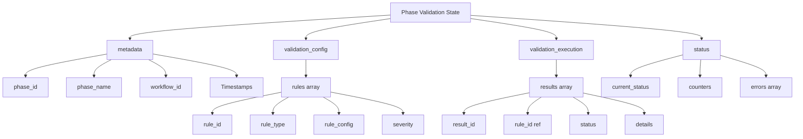
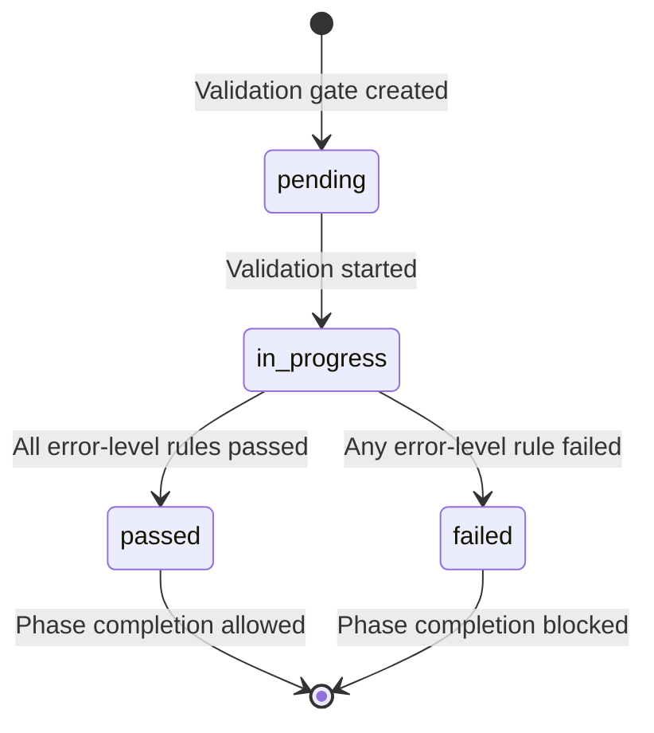

# Phase Validation State Schema Documentation

Version: 1.0
Schema File: `.claude/state/validation/validation_schema.json`
Last Updated: 2025-11-15

---

## Overview

The Phase Validation State Schema defines the structure for validation gate data in the Claude Code Delegation System. Validation gates ensure that each phase of a multi-step workflow meets quality criteria before allowing progression to the next phase.

**Purpose:**
- Track validation lifecycle (pending → in_progress → passed/failed)
- Store validation rules and configurations
- Maintain execution history with detailed results
- Capture errors for debugging and reporting
- Enable auditing and compliance

**Use Cases:**
- Multi-step workflow orchestration with quality gates
- Automated testing and verification after phase completion
- File existence and content validation
- Custom validation rule execution
- Quality assurance and compliance tracking

---

## Schema Structure

The validation state is organized into four logical sections:

```
Phase Validation State
├── schema_version (1.0)
├── metadata (phase identifiers and timestamps)
├── validation_config (rules to execute)
├── validation_execution (execution history and results)
└── status (current state and summary)
```

### High-Level Diagram



---

## Field Reference

### Top-Level Fields

| Field | Type | Required | Description |
|-------|------|----------|-------------|
| `schema_version` | string | Yes | Schema version (format: `major.minor`, e.g., `"1.0"`) |
| `metadata` | object | Yes | Phase metadata and lifecycle timestamps |
| `validation_config` | object | Yes | Validation rules configuration |
| `validation_execution` | object | Yes | Validation execution history |
| `status` | object | Yes | Current validation status and summary |

---

### Section: `metadata`

Phase identifiers and lifecycle timestamps.

| Field | Type | Required | Description |
|-------|------|----------|-------------|
| `phase_id` | string | Yes | Unique phase identifier (e.g., `"phase_1_create_calculator"`) |
| `phase_name` | string | Yes | Human-readable phase name (e.g., `"Create Calculator Module"`) |
| `workflow_id` | string | Yes | Parent workflow identifier (e.g., `"wf_20251115_143022"`) |
| `created_at` | string (ISO 8601) | Yes | When validation gate was created |
| `started_at` | string (ISO 8601) or null | No | When validation began (`null` if not started) |
| `completed_at` | string (ISO 8601) or null | No | When validation finished (`null` if not completed) |

**Example:**
```json
{
  "metadata": {
    "phase_id": "phase_1_create_calculator",
    "phase_name": "Create Calculator Module",
    "workflow_id": "wf_20251115_143022",
    "created_at": "2025-11-15T14:30:22Z",
    "started_at": "2025-11-15T14:30:25Z",
    "completed_at": "2025-11-15T14:35:40Z"
  }
}
```

---

### Section: `validation_config`

Validation rules configuration defining what checks should be performed.

#### Field: `rules` (array)

Array of validation rule objects.

**Rule Object Fields:**

| Field | Type | Required | Description |
|-------|------|----------|-------------|
| `rule_id` | string | Yes | Unique rule identifier (e.g., `"rule_file_exists_calculator"`) |
| `rule_type` | enum | Yes | Type of validation: `file_exists`, `content_match`, `test_pass`, `custom` |
| `rule_name` | string | No | Human-readable rule name (e.g., `"Verify calculator.py exists"`) |
| `rule_config` | object | Yes | Rule-specific configuration (schema varies by `rule_type`) |
| `severity` | enum | No | Rule severity: `error` (blocks completion) or `warning` (logs only). Default: `error` |

**Example:**
```json
{
  "validation_config": {
    "rules": [
      {
        "rule_id": "rule_file_exists_calculator_py",
        "rule_type": "file_exists",
        "rule_name": "Verify calculator.py exists",
        "rule_config": {
          "file_path": "/Users/user/project/calculator.py"
        },
        "severity": "error"
      },
      {
        "rule_id": "rule_test_pass_calculator",
        "rule_type": "test_pass",
        "rule_name": "Verify calculator tests pass",
        "rule_config": {
          "test_command": "pytest tests/test_calculator.py -v",
          "expected_exit_code": 0,
          "timeout_seconds": 30
        },
        "severity": "error"
      }
    ]
  }
}
```

---

### Section: `validation_execution`

Validation execution history tracking all validation attempts and results.

#### Field: `results` (array)

Array of validation result objects (chronological order).

**Result Object Fields:**

| Field | Type | Required | Description |
|-------|------|----------|-------------|
| `result_id` | string | Yes | Unique result identifier (UUID recommended for idempotency) |
| `rule_id` | string | Yes | Reference to the rule that was executed |
| `validated_at` | string (ISO 8601) | Yes | When validation was executed |
| `status` | enum | Yes | Validation result: `passed`, `failed`, `skipped` |
| `message` | string | No | Human-readable result message (e.g., `"File exists"`, `"Tests passed"`) |
| `details` | object | No | Rule-specific execution details (schema varies by `rule_type`) |

**Example:**
```json
{
  "validation_execution": {
    "results": [
      {
        "result_id": "res_c5f8a3b1_4e2d_4c9a_8b1f_2d3e4f5a6b7c",
        "rule_id": "rule_file_exists_calculator_py",
        "validated_at": "2025-11-15T14:30:26Z",
        "status": "passed",
        "message": "File /Users/user/project/calculator.py exists",
        "details": {
          "file_size_bytes": 2048,
          "file_modified_at": "2025-11-15T14:30:20Z",
          "permissions": "rw-r--r--"
        }
      },
      {
        "result_id": "res_f8g1d6e4_7h5g_4f2d_1e4h_5g6b7c8d9e0f",
        "rule_id": "rule_test_pass_calculator",
        "validated_at": "2025-11-15T14:35:35Z",
        "status": "passed",
        "message": "Tests passed: 8 passed in 1.45s",
        "details": {
          "exit_code": 0,
          "duration_seconds": 1.45,
          "stdout": "===== 8 passed in 1.45s =====",
          "test_summary": {
            "passed": 8,
            "failed": 0,
            "skipped": 0,
            "total": 8
          }
        }
      }
    ]
  }
}
```

---

### Section: `status`

Current validation status and summary information.

| Field | Type | Required | Description |
|-------|------|----------|-------------|
| `current_status` | enum | Yes | Overall status: `pending`, `in_progress`, `passed`, `failed` |
| `last_updated` | string (ISO 8601) | Yes | Timestamp of last status change |
| `passed_count` | integer | Yes | Number of rules that passed validation |
| `failed_count` | integer | Yes | Number of rules that failed validation |
| `total_count` | integer | Yes | Total number of validation rules |
| `errors` | array | No | Array of error objects for failed validations |

**Error Object Fields:**

| Field | Type | Required | Description |
|-------|------|----------|-------------|
| `error_id` | string | Yes | Unique error identifier (UUID recommended) |
| `timestamp` | string (ISO 8601) | Yes | When error occurred |
| `message` | string | Yes | Human-readable error description |
| `context` | object | No | Additional error context (e.g., `rule_id`, `file_path`, `stack_trace`) |

**Example:**
```json
{
  "status": {
    "current_status": "passed",
    "last_updated": "2025-11-15T14:35:40Z",
    "passed_count": 4,
    "failed_count": 1,
    "total_count": 5,
    "errors": [
      {
        "error_id": "err_a1b2c3d4_e5f6_4a7b_8c9d_0e1f2a3b4c5d",
        "timestamp": "2025-11-15T14:30:29Z",
        "message": "Validation rule 'rule_content_match_docstrings' failed: docstrings missing",
        "context": {
          "rule_id": "rule_content_match_docstrings",
          "rule_type": "content_match",
          "severity": "warning",
          "file_path": "/Users/user/project/calculator.py",
          "note": "This is a warning-level error and does not block phase completion"
        }
      }
    ]
  }
}
```

---

## Validation Rule Types

The schema supports four validation rule types, each with specific configuration schemas.

### 1. `file_exists`

Verifies that a file exists at the specified path.

**`rule_config` schema:**
```json
{
  "file_path": "/absolute/path/to/file.py"
}
```

**Example result `details`:**
```json
{
  "file_size_bytes": 2048,
  "file_modified_at": "2025-11-15T14:30:20Z",
  "permissions": "rw-r--r--"
}
```

---

### 2. `content_match`

Verifies that file content matches specified regex patterns.

**`rule_config` schema:**
```json
{
  "file_path": "/absolute/path/to/file.py",
  "patterns": [
    "def add\\(",
    "def subtract\\(",
    "class Calculator"
  ]
}
```

**Example result `details`:**
```json
{
  "matched_patterns": [
    {
      "pattern": "def add\\(",
      "line_number": 5,
      "matched_text": "def add(a, b):"
    }
  ],
  "total_patterns": 3,
  "matched_count": 1,
  "missing_patterns": [
    "def subtract\\(",
    "class Calculator"
  ]
}
```

---

### 3. `test_pass`

Verifies that a test command executes successfully.

**`rule_config` schema:**
```json
{
  "test_command": "pytest tests/test_calculator.py -v",
  "expected_exit_code": 0,
  "timeout_seconds": 30
}
```

**Example result `details`:**
```json
{
  "exit_code": 0,
  "duration_seconds": 1.45,
  "stdout": "===== 8 passed in 1.45s =====",
  "stderr": "",
  "test_summary": {
    "passed": 8,
    "failed": 0,
    "skipped": 0,
    "total": 8
  }
}
```

---

### 4. `custom`

Executes a custom validation script.

**`rule_config` schema:**
```json
{
  "script_path": "/absolute/path/to/validate.sh",
  "args": ["--strict", "--verbose"],
  "timeout_seconds": 60
}
```

**Example result `details`:**
```json
{
  "exit_code": 0,
  "duration_seconds": 2.34,
  "stdout": "All checks passed",
  "stderr": ""
}
```

---

## Status State Transitions

Valid status transitions follow this lifecycle:



**Transition Rules:**
- `pending` → `in_progress`: When first validation rule executes
- `in_progress` → `passed`: When all error-severity rules pass (warnings ignored)
- `in_progress` → `failed`: When any error-severity rule fails
- **No backward transitions:** Status never reverts (e.g., `passed` → `in_progress` is invalid)

**Severity Impact:**
- `error` severity: Failure blocks phase completion (status → `failed`)
- `warning` severity: Failure logged but doesn't block completion (status can still be `passed`)

---

## Usage Examples

### Creating a New Validation Gate

```json
{
  "schema_version": "1.0",
  "metadata": {
    "phase_id": "phase_2_write_tests",
    "phase_name": "Write Unit Tests",
    "workflow_id": "wf_20251115_143022",
    "created_at": "2025-11-15T14:40:00Z",
    "started_at": null,
    "completed_at": null
  },
  "validation_config": {
    "rules": [
      {
        "rule_id": "rule_test_file_exists",
        "rule_type": "file_exists",
        "rule_name": "Verify test file exists",
        "rule_config": {
          "file_path": "/Users/user/project/tests/test_module.py"
        },
        "severity": "error"
      }
    ]
  },
  "validation_execution": {
    "results": []
  },
  "status": {
    "current_status": "pending",
    "last_updated": "2025-11-15T14:40:00Z",
    "passed_count": 0,
    "failed_count": 0,
    "total_count": 1,
    "errors": []
  }
}
```

---

### Adding Validation Rules

To add a new rule, append to the `validation_config.rules` array:

```json
{
  "rule_id": "rule_coverage_check",
  "rule_type": "custom",
  "rule_name": "Verify test coverage >= 80%",
  "rule_config": {
    "script_path": "/Users/user/project/scripts/check_coverage.sh",
    "args": ["--minimum", "80"],
    "timeout_seconds": 45
  },
  "severity": "warning"
}
```

Update `status.total_count` to reflect the new rule count.

---

### Recording Validation Results

After executing a rule, append to `validation_execution.results`:

```json
{
  "result_id": "res_a1b2c3d4_e5f6_4a7b_8c9d_0e1f2a3b4c5d",
  "rule_id": "rule_test_file_exists",
  "validated_at": "2025-11-15T14:40:05Z",
  "status": "passed",
  "message": "Test file exists at /Users/user/project/tests/test_module.py",
  "details": {
    "file_size_bytes": 1024,
    "file_modified_at": "2025-11-15T14:39:50Z"
  }
}
```

Update status counters:
- `status.passed_count` (increment if passed)
- `status.failed_count` (increment if failed)
- `status.last_updated` (set to current timestamp)

---

### Updating Status

After all rules execute, update `status.current_status`:

```json
{
  "status": {
    "current_status": "passed",
    "last_updated": "2025-11-15T14:40:10Z",
    "passed_count": 1,
    "failed_count": 0,
    "total_count": 1,
    "errors": []
  }
}
```

Update `metadata.completed_at` when validation finishes:

```json
{
  "metadata": {
    "completed_at": "2025-11-15T14:40:10Z"
  }
}
```

---

### Handling Errors

When a validation fails, add to `status.errors` array:

```json
{
  "error_id": "err_b2c3d4e5_f6a7_4b8c_9d0e_1f2a3b4c5d6e",
  "timestamp": "2025-11-15T14:40:08Z",
  "message": "File not found: /Users/user/project/tests/test_missing.py",
  "context": {
    "rule_id": "rule_test_file_exists",
    "rule_type": "file_exists",
    "severity": "error",
    "file_path": "/Users/user/project/tests/test_missing.py",
    "errno": 2
  }
}
```

Update status:
- `status.current_status` → `"failed"` (if error-severity)
- `status.failed_count` (increment)
- `status.last_updated` (set to current timestamp)

---

## Best Practices

### 1. Use UUIDs for Identifiers

Generate unique identifiers for `result_id` and `error_id` using UUIDs to ensure idempotency:

```bash
# Example UUID: res_c5f8a3b1_4e2d_4c9a_8b1f_2d3e4f5a6b7c
uuidgen | tr '[:upper:]' '[:lower:]' | sed 's/-/_/g' | sed 's/^/res_/'
```

### 2. Always Use ISO 8601 Timestamps

Timestamps must use ISO 8601 format with UTC timezone:

```python
from datetime import datetime, timezone

timestamp = datetime.now(timezone.utc).isoformat().replace('+00:00', 'Z')
# Result: "2025-11-15T14:30:22Z"
```

### 3. Validate Schema Before Writing

Use a JSON Schema validator to check data before writing:

```python
import jsonschema

with open('.claude/state/validation/validation_schema.json') as f:
    schema = json.load(f)

jsonschema.validate(instance=validation_data, schema=schema)
```

### 4. Atomic File Updates

Write validation state atomically to prevent corruption:

```python
import json
import tempfile
import os

# Write to temporary file
with tempfile.NamedTemporaryFile(mode='w', delete=False) as tmp:
    json.dump(validation_data, tmp, indent=2)
    tmp_path = tmp.name

# Atomic rename
os.rename(tmp_path, validation_file_path)
```

### 5. Enforce Status Transitions

Validate status transitions before updating:

```python
VALID_TRANSITIONS = {
    'pending': ['in_progress'],
    'in_progress': ['passed', 'failed'],
    'passed': [],
    'failed': []
}

def is_valid_transition(current, new):
    return new in VALID_TRANSITIONS.get(current, [])
```

### 6. Separate Error vs Warning Failures

Only error-severity failures should block phase completion:

```python
def calculate_status(results, rules):
    error_rules = [r for r in rules if r.get('severity', 'error') == 'error']
    error_results = [res for res in results if res['rule_id'] in [r['rule_id'] for r in error_rules]]

    failed_errors = [res for res in error_results if res['status'] == 'failed']

    if failed_errors:
        return 'failed'
    elif all(res['status'] in ['passed', 'skipped'] for res in error_results):
        return 'passed'
    else:
        return 'in_progress'
```

### 7. Limit Result History

Consider retention policy to prevent unbounded growth:

```python
MAX_RESULTS_PER_RULE = 10

# Keep only last N results per rule
results_by_rule = {}
for result in validation_data['validation_execution']['results']:
    rule_id = result['rule_id']
    results_by_rule.setdefault(rule_id, []).append(result)

# Trim to MAX_RESULTS_PER_RULE
for rule_id, results in results_by_rule.items():
    results_by_rule[rule_id] = sorted(results, key=lambda r: r['validated_at'])[-MAX_RESULTS_PER_RULE:]
```

### 8. Include Contextual Error Information

Capture sufficient context for debugging:

```python
error = {
    'error_id': generate_uuid('err'),
    'timestamp': get_iso_timestamp(),
    'message': f"File not found: {file_path}",
    'context': {
        'rule_id': rule['rule_id'],
        'rule_type': rule['rule_type'],
        'severity': rule.get('severity', 'error'),
        'file_path': file_path,
        'errno': e.errno,
        'stack_trace': traceback.format_exc() if debug_mode else None
    }
}
```

---

## Schema Evolution

The schema includes a `schema_version` field to support future evolution.

**Version Format:** `major.minor` (e.g., `1.0`, `1.1`, `2.0`)

**Version Increment Rules:**
- **Major version** (e.g., `1.0` → `2.0`): Breaking changes (removed fields, changed field types, incompatible structure)
- **Minor version** (e.g., `1.0` → `1.1`): Backward-compatible changes (new optional fields, new enum values)

**Backward Compatibility Strategy:**

1. **Reading old schemas:** Tools should handle missing optional fields gracefully
2. **Writing new schemas:** Always include `schema_version` in output
3. **Migration:** Provide migration scripts for major version upgrades

**Example Migration (1.0 → 2.0):**

```python
def migrate_schema_1_to_2(data):
    if data['schema_version'] == '1.0':
        # Add new required fields with defaults
        data['schema_version'] = '2.0'
        data['status']['retry_count'] = 0  # New field in 2.0
    return data
```

---

## Sample Data

A complete example validation state file is available at:

```
.claude/state/validation/test_phase_validation.json
```

This file demonstrates:
- Complete phase lifecycle (created → started → completed)
- Multiple rule types (`file_exists`, `content_match`, `test_pass`)
- Both passed and failed results
- Error tracking with warning-level failure
- All timestamp fields populated
- Realistic file paths and configurations

---

## Related Documentation

- **Validation System Implementation:** `docs/phase-b-validation-implementation.md`
- **Workflow Orchestration:** `system-prompts/WORKFLOW_ORCHESTRATOR.md`
- **Delegation Architecture:** `CLAUDE.md` (Architecture Overview section)
- **State Management:** `.claude/state/` directory structure

---

## Schema Reference

**Full JSON Schema:** `.claude/state/validation/validation_schema.json`

**Schema ID:** `https://claude-code-delegation-system/schemas/phase-validation-v1.json`

**JSON Schema Draft:** Draft 7 (`http://json-schema.org/draft-07/schema#`)

---

## Questions or Issues

For questions about the schema or to report issues:

1. Check existing validation state files in `.claude/state/validation/`
2. Review test data in `test_phase_validation.json`
3. Consult the JSON Schema file for formal validation rules
4. See implementation examples in validation scripts

---

**Document Version:** 1.0
**Last Updated:** 2025-11-15
**Maintained By:** Claude Code Delegation System - Tech Lead Architect
