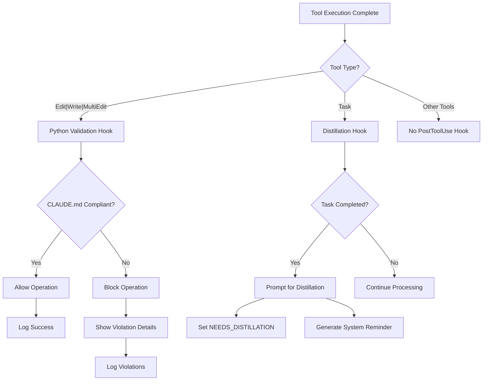

# PostToolUse Hooks

## Purpose
PostToolUse hooks process and analyze tool execution results, providing:
- Result distillation
- Metadata extraction
- Secondary processing of tool outputs

## Current Implementation
- `distill-essence.py`: Script for extracting key insights from tool execution
- `python_posttooluse_hook.sh`: Shell script for additional post-processing

### Features
- Analyze tool execution results
- Extract structured metadata
- Perform secondary transformations
- Log detailed interaction information

## Workflow Diagram

## Workflow
1. Receive tool execution results
2. Apply post-processing logic
3. Generate enhanced metadata
4. Log comprehensive interaction details

## Integration
Currently integrated with shell and Python scripts for flexible post-processing.

## Logging Considerations
- Use structured logging
- Capture execution metadata
- Record performance and insights

## Potential Use Cases
- Summarize complex tool outputs
- Generate performance metrics
- Detect anomalies in tool execution
- Prepare results for downstream processing

## Status
Experimental implementation with active development potential.

## Future Roadmap
- Enhance result distillation algorithms
- Add more sophisticated analysis techniques
- Improve metadata extraction precision