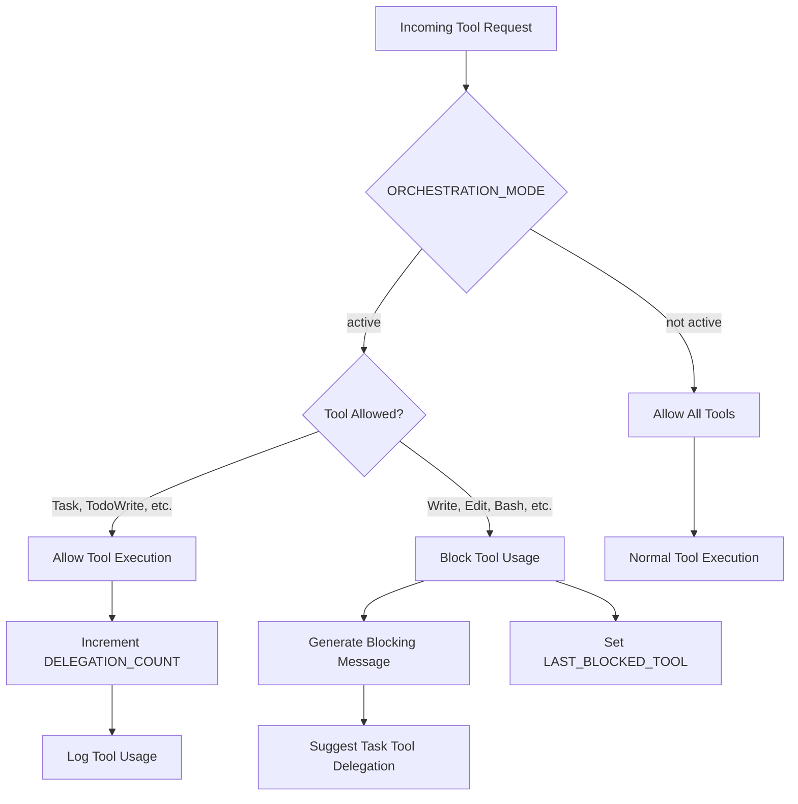

# PreToolUse Hooks

## Purpose
PreToolUse hooks intercept and validate tool usage requests before execution, providing:
- Access control mechanisms
- Request delegation
- Preliminary validation and filtering

## Current Implementation
`enforce-delegation.py`: A script designed to manage tool usage delegation and access controls.

### Status
**Current Status**: Not actively triggered by Claude Code
- Script exists but requires integration
- Potential for implementing access control logic

## Workflow Diagram

## Example Use Cases
- Validate user permissions before tool execution
- Redirect complex tool requests to specialized agents
- Apply preliminary filtering on tool usage

## Implementation Details
- Receives tool usage context as input
- Can modify, approve, or block tool requests
- Should return standardized response format

## Recommended Workflow
1. Inspect incoming tool usage request
2. Apply delegation or access control rules
3. Return decision with optional metadata

## Logging
Use structured logging to track hook interactions and decisions.

## Future Enhancements
- Implement comprehensive permission matrix
- Add more sophisticated delegation logic
- Integrate with authentication systems