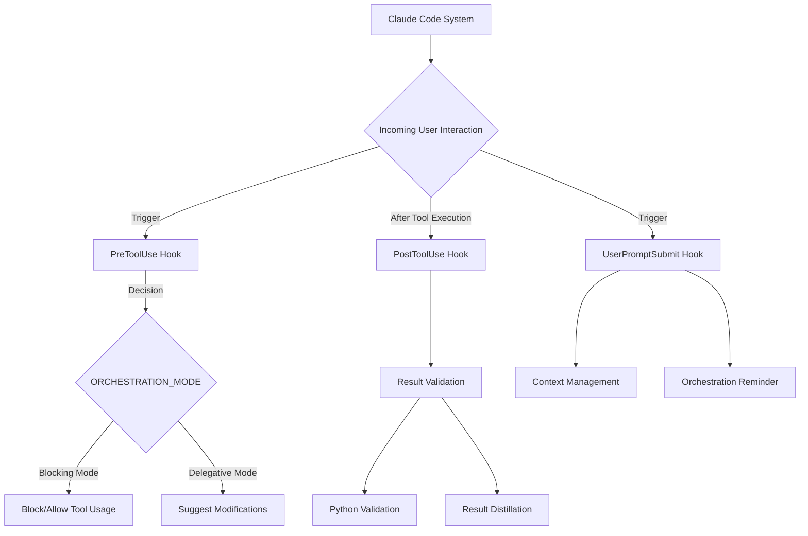

# Claude Code Hooks System

## Overview
This directory contains a modular hook system for Claude Code interactions, providing extensible lifecycle management for tool usage, user prompt submission, and interaction tracking.

## Directory Structure
```
hooks/
├── PreToolUse/        # Hooks executed before tool usage
├── PostToolUse/       # Hooks executed after tool usage
└── UserPromptSubmit/  # Hooks triggered on user prompt submission
```

## Purpose
The hooks system enables:
- Pre-processing of tool usage requests
- Post-processing of tool execution results
- Custom orchestration of user prompt interactions
- Delegation and access control mechanisms

## System Architecture



## Quick Start
To use hooks:
1. Implement hook scripts in respective directories
2. Ensure executable permissions (`chmod +x script.py`)
3. Claude Code will automatically detect and execute applicable hooks

## Configuration
- Hooks are Python or shell scripts
- Must follow naming conventions
- Should handle errors gracefully
- Log interactions using structured logging

## Status
Current implementation is experimental and may require further refinement.

## Reference
See `claude-hooks-workflow.md` for detailed implementation guidelines.