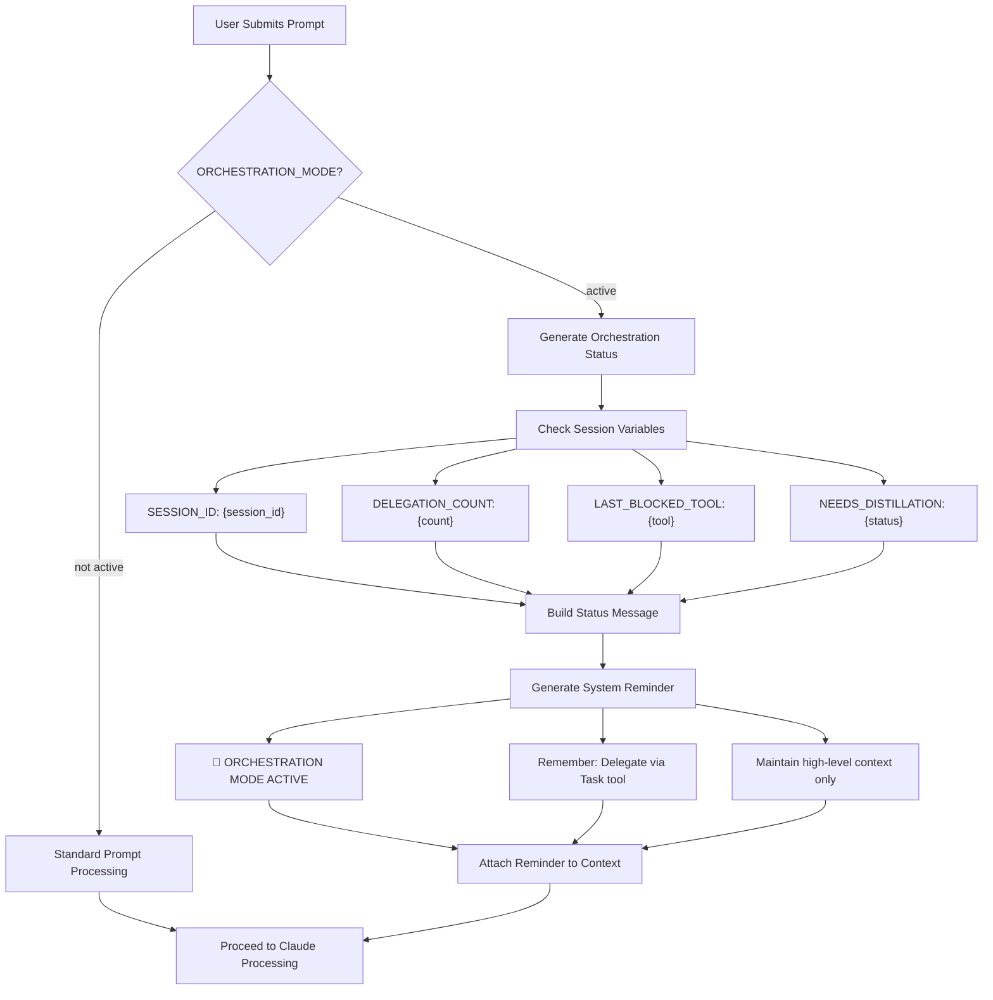

# UserPromptSubmit Hooks

## Purpose
UserPromptSubmit hooks manage and orchestrate user prompt interactions, providing:
- Prompt preprocessing
- Contextual enhancement
- Interaction tracking

## Current Implementation
`orchestration-reminder.py`: A script designed to manage and enhance user prompt submissions.

## Key Objectives
- Preprocess and validate user prompts
- Inject contextual information
- Apply interaction guidelines
- Prepare prompts for further processing

## Workflow Diagram

## Workflow
1. Receive initial user prompt
2. Apply preprocessing rules
3. Enhance prompt with contextual metadata
4. Prepare for system interaction

## Implementation Details
- Analyze prompt structure and content
- Apply contextual reminder mechanisms
- Potentially modify or augment prompt

## Logging
Implement comprehensive logging to track:
- Prompt origin
- Preprocessing steps
- Contextual enhancements
- Interaction metadata

## Example Use Cases
- Apply system-wide interaction guidelines
- Inject contextual reminders
- Validate prompt against usage policies
- Prepare prompts for specialized routing

## Current Status
Experimental implementation under active development.

## Future Enhancements
- More sophisticated prompt preprocessing
- Advanced contextual injection
- Machine learning-based prompt analysis